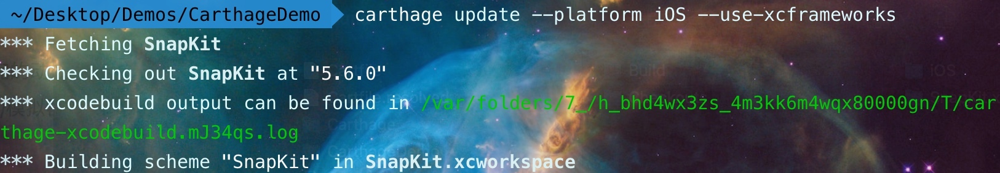

# 依赖管理：如何使用 CocoaPods 统一依赖库的管理？


<!-- more -->

在 iOS App 开发方面，几乎所有的 App 都需要使用到第三方依赖库。依赖库不仅能为我们提供丰富的功能，还能避免我们从头开发，在节省时间的同时也减少许多 Bug 。

但伴随着软件功能越来越丰富，依赖库数量越来越多，由此也出现了“依赖地狱”，比如依赖库循环依赖，底层依赖库版本冲突等。为了解决此类问题，于是，依赖库管理工具也就出现了。

目前流行的依赖库管理工具主要有：**Git Submodules**、**Carthage**、 **Swift Package Manager** 和 **CocoaPods**。在这里我们选择 CocoaPods。为什么呢？原因有三：

1. CocoaPods 非常成熟，十分稳定，并且简单易用，学习成本低，效果明显；

2. CocoaPods 会自动整合 Xcode 项目，使得其他项目成员在使用第三方库时无须任何额外的手工操作；

3. CocoaPods 已经成为 iOS 业界标准，支持几乎所有的开源库和商业库，即便是 Objective-C 的依赖库以及二进制文件（binary）依赖库，CocoaPods 也提供支持。

那么，怎样使用 CocoaPods 来管理第三方依赖库呢？接下来我会从**语义化版本管理**、**Pod 版本管理**、**Pod 版本更新**三个方面展开介绍。

## 语义化版本管理

开发软件，免不了要更新迭代，所以每一次更新的版本号管理变得很重要。并且，一旦版本号混乱，就会导致一系列问题，比如很难查找和修改线上崩溃，没办法支持多团队并行开发，等等。为了避免此类问题，我们可以使用语义化版本管理（Semantic Versioning）来统一版本号的定义规范。

语义化版本号是一种通用的版本号格式规范，目前绝大部分优秀的第三方依赖库都遵循这一规范来发布版本。

具体来说，语义化版本号的版本号一般包括四部分：`MAJOR、MINOR、PATCH、BUILD`。每一部分都由递增的数值组成，例如 1.2.3.4，其中 1 是MAJOR， 2 是 MINOR。如果我们更新 MINOR 版本号，那么下一个版本就是 1.3.0.0。接下来我详细介绍下这四部分。

* **MAJOR 是指主版本号**，通常在重大更新的时候才会需要更新主版本号。例如 iOS 每年都会更新一个主版本号。而对于第三方库来说，主版本号的更新，表示该库的 API 新增了重大功能，或者引入了不可兼容的更新 （breaking changes）。

* **MINOR 是指副版本号**，用于小功能的改善。例如 iOS 14 在发布主版本后，在一年内可能发布多个副版本如 14.1、 14.2 来完善其系统功能。一般对于第三方库来说，副版本的更新就是新增一些 API，但不包含不可兼容的更新。

* **PATCH 是指补丁版本号**，一般用于 bug fix 以及修复安全性问题等。对于第三方库来说，补丁版本号的更新也不应该有不可兼容的更新。虽然实际操作中这会有些困难，但我们可以通过把原有 API 标记为 deprecated，或者为新 API 参数提供默认值等办法来解决。

* **BUILD 是指构建版本号**，通常在内部测试时使用。一般当我们使用 CI 服务器进行自动构建时，构建版本号会自动更新。

## Pod 版本管理

要使用 CocoaPods 管理第三方依赖库，首先要新建一个 Podfile 文件，然后执行 `bundle exec pod install` 命令来安装所有依赖库。这时候 CocoaPods 会自动帮我们建立一个 Podfile.lock 文件和一个 Workspace文档。

注意，在第一讲我们说过，由于是通过 Bundler 来安装 CocoaPods，每次执行`pod`命令前，都需要加上`bundle exec`。不过为了简洁，后面涉及`pod`命令时，我会省略`bundle exec`部分。

接下来，我详细介绍下 Podfile 文件、 Podfile.lock 和 Workspace 文档到底是什么，以及如何使用。

### Podfile 文件

`Podfile` 文件是一个配置文件，它主要是用来描述 Xcode 项目里各个 target 的依赖库。我们项目的 Podfile 文件可以在[仓库中](https://github.com/lagoueduCol/iOS-linyongjian/blob/main/Podfile)找到。在这里，我主要和你介绍一下 Podfile 文件中的几个重要配置。

### source 配置

`source`用于指向 PodSpec（Pod 规范）文件的 Repo，从而使得 CocoaPods 能查询到相应的 PodSpec 文件。

具体来说，当使用公共依赖库的时候，source需要指向 CocoaPods Master Repo，这个主仓库集中存放所有公共依赖库的 PodSpec 文件。 由于 CocoaPods 经常被开发者吐槽 Pod 下载很慢，因此 CocoaPods 使用了 CDN （Content Delivery Network，内容分发网络）来缓存整个 CocoaPods Master Repo， 方便开发者快速下载。具体的配置方法就是使source指向 CND 的地址，代码示例如下：

```js
source 'https://cdn.cocoapods.org/'
```

如果使用的是私有依赖库，我们也需要把source指向私有库的 PodSpec Repo，以使得 CocoaPods 能找到相应的 PodSpec 文件。 代码示例如下：

```js
source 'https://my-git-server.com/internal-podspecs'
```

注意，当我们使用私有库时，执行pod install命令的机器必须能访问到source所指向的 Repo。

### project 和 workspace

project用于指定我们的主项目文档。该项目文档会使用到 CocoaPods 管理的所有第三方依赖库。

workspace用于指定要生成和更新的 Workspace 文档。和其他依赖库管理工具不一样，CocoaPods 会自动生成一个 Workspace 文档，然后我们只能使用该文档而不是 Xcode 项目文档来进行后续开发。

代码示例如下：

```js
project './Moments/Moments.xcodeproj'
workspace './Moments.xcworkspace'
```

这其中 `Moments.xcodeproj` 就是我们的主项目文档，它一般放在和项目名字相同的下一层目录下。

而 `Moments.xcworkspace` 是 CocoaPods 为我们生成的 Workspace文档，为了统一，我建议名字也是和主项目相同。

### platform 和 use_frameworks

先看示例，它表示什么呢？

```js
platform :ios, '14.0'
use_frameworks!
```

为了保证所有依赖库与主项目在编译和运行时兼容，我们指定的系统版本号需要和主项目所支持的系统版本号保持一致。而`platform`就是用于指定操作系统以及所支持系统的最低版本号。比如，例子中的`platform :ios, '14.0'`就表示支持 iOS 14.0 以上的所有 iOS 版本。

另外一行的`use_frameworks!`这一配置会让 CocoaPods 把所有第三方依赖库打包生成一个动态加载库，而不是静态库。因为动态库是我们经常用到的，它能有效地加快编译和链接的速度。

### 组织同类型的第三方依赖库

```js
def dev_pods
  pod 'SwiftLint', '0.40.3', configurations: ['Debug']
  pod 'SwiftGen', '6.4.0', configurations: ['Debug']
end
```

其中`configurations: ['Debug']`用于指定该依赖库只是使用到`Debug`构建目标（target）里面，而不在其他（如`Release`）构建目标里面，这样做能有效减少 App Store 发布版本的体积。

`def dev_pods end`代码块是“复用同一类依赖库方式”的意思，我们可以把同类型的依赖库都放进这个代码块里面。比如，我们的 Moments 项目中就分别有`dev_pods`（开发相关的库）,`core_pods`（核心库）以及`thirdparty_pods`(第三方库)等代码块定义。

### target 配置

有了这些复用库定义以后，怎样使用到项目的构建目标（target）里面呢？下面就是一个例子。

```js
target 'Moments' do
  dev_pods
  core_pods
  # other pods...
end
```

我们可以把构建目标所使用的所有依赖库放进`target`代码块中间，上面中的`Moments`就是我们的 App 构建目标。该构建目标依赖了`dev_pods`和`core_pods`等各组依赖库。执行`pod install`的时候，CocoaPods 会把`dev_pods`代码块自动展开为`SwiftLint`和`SwiftGen`，那么`Moments`构建目标能使用`SwiftLint`和`SwiftGen`依赖库了。

### 依赖库的版本

```js
pod 'RxSwift', '= 5.1.1'
pod 'RxRelay', '= 5.1.1'
```

在 CocoaPods 里面，每一个依赖库称为一个 Pod （注意这里首字母大写，Pod 指一个库），指定一个 Pod 的命令是`pod`（注意这里是小写，表示一条命令）。在 Podfile 里面我们可以通过这样的格式`pod 'RxSwift', '= 5.1.1'`来配置依赖库的版本号。其中，`RxSwift`或者`RxRelay`是依赖库的名字，`5.1.1`为版本号。这些库的名字以及版本号都可以在 CocoaPods 官网上找到。

**为了统一管理第三方依赖库的版本，我建议统一使用 `= `来锁定该依赖库的版本，这样就能保证每次执行`pod install`的时候都可以为同一个库下载同一个版本。**

除了 `=` 操作符以外，CocoaPods 还支持其他操作符来指定版本：

* `> 0.1`表示大于 0.1 的任何版本，这样可以包含 0.2 或者 1.0；

* `>= 0.1`表示大于或等于 0.1 的任何版本；

* `< 0.1`表示少于 0.1 的任何版本；

* `<= 0.1`表示少于或等于 0.1 的任何版本；

* `~> 0.1.2`表示大于 0.1.2 而且最高支持 0.1.* 的版本，但不包含 0.2 版本。

这几个操作符相里面，`~>`（Squiggy arrow）操作符更为常用，它是以最后一个部分的版本号（例子中 0.1.2 的最后一个部分是补丁版本号 ..2）来计算可以支持的最高版本号。

例如`~> 0.1.2`表示 >= 0.1.2 并且 < 0.2.0，但不能等于 0.2.0， 因为 0.2.0 已经更新了副版本号而不仅仅是补丁版本号了。

另外一个例子是`~> 0.1`，表示  >= 0.1  并且 < 1.0，举例来说，我们可以更新到 0.9 但不能更新到 1.0。

前面我介绍的是引用外部的第三方依赖库，如果我们的项目有自己的内部依赖库，要怎样在 CocoaPods 引用它呢？其实很简单，我们可以执行以下命令：

```js
pod 'DesignKit', :path => './Frameworks/DesignKit', :inhibit_warnings => false
```

和其他外部依赖库不一样，我们需要使用`:path`来指定该内部库的路径。

### Podfile.lock 文件

`Podfile.lock` 文件是由 CocoaPods 自动生成和更新的，该文件会详细列举所有依赖库具体的版本号。比如，

```js
DEPENDENCIES:
  - Alamofire (= 5.2.0)
  - Firebase/Analytics (= 7.0.0)
PODFILE CHECKSUM: 400d19dbc4f5050f438797c5c6459ca0ef74a777
```

当执行`pod install`后，CocoaPods 会根据 Podfile 文件解释出各依赖库的特定版本号，然后一一列举在 `DEPENDENCIES` 下面。在上述的例子中，我们的 App 在构建过程中使用了5.2.0 的 Alamofire 库以及 7.0.0 的 Firebase Analytics 库。

`PODFILE CHECKSUM` 用于记录 Podfile 的验证码，任何库的版本号的更改，都会改变该验证码。这样能帮助我们在不同的机器上，快速检测依赖库的版本号是否一致。

我建议要把 `Podfile` 和 `Podfile.lock` 文件一同 commit 并 push 到 Git 代码管理服务器里面。特别是在团队开发的环境下，这样能帮助我们保证各个依赖库版本号的一致性。

在实践操作中，无论我们在哪台机器上执行`pod install`， `PODFILE CHECKSUM` 都不应该发生任何改变。因为我们在 Git 保存了 `Podfile.lock`，一旦我们发现老版本 App 的 Bug ，就可以根据该文件为各个依赖库重新安装同一版本号，来重现和定位问题，从而帮助我们快速修改这些 Bug。

### Workspace 文档

`Workspace` 文档是 Xcode 管理子项目的方式。通过 Workspace，我们可以把相关联的多个 Xcode 子项目组合起来方便开发。

前面说过，当我们执行`pod install`的时候，CocoaPods 会自动创建或者更新一个叫作 Pods 的项目文档（`Pods.xcodeproj` ）以及一个 Workspace 文档（在我们项目中叫作 `Moments.xcworkspace`）。

其中，Pods 项目文档负责统一管理各个依赖库，当我们在 Podfile 里面指定构建成动态库的时候，该项目会自动生成一个名叫`Pods_<项目名称>.framework`的动态库供我们项目使用。

而 Workspace 文档则统一管理了我们原有的主项目 （Moments.xcodeproj）以及那个 Pods 项目。

与此同时，CocoaPods 还会修改 Xcode 项目中的 `Build Phases`  以此来检测 `Podfile.lock` 和 `Manifest.lock` 文件的一致性，并把`Pods_<项目名称>.framework`动态库嵌入我们的主项目中去。

以上所有操作都是由 CocoaPods 自动帮我们完成。以后的开发，我们都可以打开 Workspace 文档而不是原有的 Xcode 项目文档来进行。

## Pod 版本更新

使用 CocoaPods 管理第三方依赖库的操作非常简单，可是一旦使用不当，特别是在 Pod 更新的时候，很容易引起依赖库版本不一致，从而出现各种问题。

比如，在编译程序的时候，有些开发者可以顺利进行，而另外一些开发者编译时候就会出错；或者程序在本地编译时运行良好，一旦在 `CI` 上构建，就会出现 App 崩溃，等等。

那么，怎么保证更新 Pod 的时候都能保证版本一致呢？

下面结合我的实践经验，以第三方网络库 Alamofire 为例子和你介绍下。

**第一步**，CocoaPods 已经为我们提供了`pod outdated`命令，我们可以用它一次查看所有 Pod 的最新版本，而无须到 GitHub 上逐一寻找。下面是执行`pod outdated`命令的其中一条结果：

```js
The following pod updates are available:
- Alamofire 5.2.0 -> 5.2.0 (latest version 5.4.0)
```

这表示当前我们使用了版本为 5.2.0 的 Alamofire ，其最新版本为 5.4.0。如果我们决定更新到版本 5.4.0，那么可以继续下一步。

**第二步**，在更新依赖库版本之前，为了避免在新版本中不小心引入 Bug，我们需要了解新的版本到底提供了哪些新功能，修改了哪些 Bug，与老版本是否兼容等事项。具体我们可以到 CocoaPods 官网上查找需要更新的第三方依赖库，然后在 GitHub 等平台上找到，并仔细阅读该库的版本说明（`release note`）。

`请注意，我们要阅读当前使用版本到要更新的版本之间的所有版本说明`。 在这个例子中，我们要阅读 5.2.1，5.2.2，5.3.0 和 5.4.0 的所有版本说明。这些版本说明会列出新增功能，更新的 API，修改的 Bug，有没有不可兼容的更新 。

**第三步**，在 Podfile 文件里把要更新的 Pod 的版本号进行修改。例如把`pod 'Alamofire', '= 5.2.0'`改成`pod 'Alamofire', '= 5.4.0'`。 然后执行pod install来重新生成 Podfile.lock 文件。

此时特别注意的是，我们要使用`pod install`而不是`pod update`。因为执行pod update会自动更新所有 Pod 的版本，这可能会更新了一些我们目前还不想更新的 Pod，从而会引入一些难以觉察的问题。

**第四步**，如果所更新的版本包含了不可兼容的更新，我们需要修改代码来保证代码能顺利完成编译。

**第五步**，很多第三方依赖库都是一些通用的基础组件，一旦发生问题会影响到整个 App 的功能，因此我们需要根据所更新的库进行回归测试。例如当更新了 Alamofire 库的时候，我们需要把每个网络请求都执行一遍，避免所更新的版本引入新的 Bug。

**第六步**，为了把更新的版本共享给所有开发者和 CI 服务器，我们需要把 Podfile 和 Podfile.lock 文件一同 commit 并 push 到 Git 代码管理服务器，并通过 Pull Request 流程并入主分支。

**第七步**，一旦更新的代码并入主分支后，要通过 Slack 等内部通信软件告诉所有开发者 pull 或者 rebase 主分支的代码，并执行pod install来更新他们开发环境的所有依赖库。

`特别注意，千万不要使用pod update，因为pod update会自动把开发者机器上所有 Pod 的版本自动更新了`。这种更新往往不是我们想要的结果，我们希望统一更新各个 Pod 的版本，并通过 Git 进行集中管理。

如果开发者在编译新代码前没有执行pod install命令，会出现以下的错误。

>The sandbox is not in sync with the Podfile.lock. Run 'pod install' or update your CocoaPods installation.

这错误可以有效提醒所有开发者，需要再次执行pod install来更新他们本地的依赖库，从而保证所有开发者使用的依赖库的版本都是一致的。

另外，如果更新了基础组件的依赖库（如网络库），在测试阶段，我们还需要进行全面的回归测试。因为这些基础组件库的新版本如果有 Bug 很可能导致我们的 App 会发生大比例的崩溃，严重影响用户的体验。

有了上面的一流程，我们就可以有效地保证每个开发者使用的依赖库版本都是一致的，同时也能保证 CI 在自动构建 App 的时候所使用的依赖库版本也是统一的。

## 总结

这一讲我介绍了如何使用 CocoaPods 来统一管理依赖库的版本。特别是根据我自己的经验总结了一套更新 Pod 版本的流程，希望你灵活使用这些步骤，从而少走弯路。


**这里我再特别强调一下，为了保证依赖库版本都能保持一致，尽量不要执行pod update，而是使用通过修改 Podfile 文件里的版本号并执行pod install来更新 Pod 的版本，然后把 Podfile 和 Podfile.lock 文件一同并入 Git 主分支中进行统一管理。**

### 源码地址：

>Podfile 文件地址：
https://github.com/lagoueduCol/iOS-linyongjian/blob/main/Podfile


# 学习笔记与扩展

## Cartahge 的简单使用

### 一、安装 Carthage：

```js
// 安装
brew install carthage
// 查看版本
carthage version
// 升级
brew upgrade carthage
// 卸载
brew uninstall carthage
```


### 二、使用 Carthage 下载三方库

#### 1、在工程文件里创建 Cartfile 文件:

`cd` 到工程目录下，然后执行如下命令：

```js
// 创建 Cartfile 文件
touch Cartfile
// 使用 Xcode 命令打开 Cartfile 文件
open -a Xcode Cartfile
```

#### 2、在 Cartfile 文件添加依赖库

```js
github "SnapKit/SnapKit" ~> 5.6.0
```


版本含义：如果没有指明版本号，则会自动使用最新的版本
* `~>5.0`：表示使用版本 `5.0` 以上但是低于 `6.0` 的最新版本，如 `5.1` ，`5.4`
* `==5.0`：表示使用 `5.0` 版本
* `>=5.0`：表示使用 `5.0` 或更高的版本

#### 3、保存 Cartfile 文件，然后执行安装

```js
// 下载添加依赖库的第三方框架
carthage update
```

执行成功之后，会在工程目录里生成一个 `Carthage` 的文件夹，里面有自动生成的 `framework`:


* 有时候 Carthage 更新会出现 arm64 报错：

```js
A shell task (/usr/bin/xcrun lipo -create /Users/coming_ay/Library/Caches/org.carthage.CarthageKit/DerivedData/12.5.1_12E507/Alamofire/5.4.4/Build/Intermediates.noindex/ArchiveIntermediates/Alamofire\ iOS/IntermediateBuildFilesPath/UninstalledProducts/iphoneos/Alamofire.framework/Alamofire /Users/coming_ay/Library/Caches/org.carthage.CarthageKit/DerivedData/12.5.1_12E507/Alamofire/5.4.4/Build/Products/Release-iphonesimulator/Alamofire.framework/Alamofire -output /Users/coming_ay/Desktop/AY_Project/123456/Carthage/Build/iOS/Alamofire.framework/Alamofire) failed with exit code 1:
fatal error: /Applications/Xcode.app/Contents/Developer/Toolchains/XcodeDefault.xctoolchain/usr/bin/lipo: /Users/coming_ay/Library/Caches/org.carthage.CarthageKit/DerivedData/12.5.1_12E507/Alamofire/5.4.4/Build/Intermediates.noindex/ArchiveIntermediates/Alamofire iOS/IntermediateBuildFilesPath/UninstalledProducts/iphoneos/Alamofire.framework/Alamofire and /Users/coming_ay/Library/Caches/org.carthage.CarthageKit/DerivedData/12.5.1_12E507/Alamofire/5.4.4/Build/Products/Release-iphonesimulator/Alamofire.framework/Alamofire have the same architectures (arm64) and can't be in the same fat output file

Building universal frameworks with common architectures is not possible. The device and simulator slices for "Alamofire" both build for: arm64
Rebuild with --use-xcframeworks to create an xcframework bundle instead.
```

* 根据提示终端重新输入：

```js
// 不区分iOS、macOS
carthage update --use-xcframeworks
// 只限iOS
carthage update --platform iOS --use-xcframeworks
```



### 三、将下载三方框架集成到项目

#### 1、添加 framework 文件：

打开工程文件中的iOS文件夹 -> 将 framework 文件拖入到项目 General 中的 Frameworks，Libraries 中


#### 2、添加编译脚本：

**Target -> Build Phases -> 点击 + -> New Run Script Phase** -> 添加如下脚本：

`/usr/local/bin/carthage copy-frameworks`


#### 3、编译，导入头文件使用

编译，然后导入头文件使用，但是可能会出现如下错误：


这是因为，我使用的是模拟器运行，但是导入的却是 iOS 真机的 framework，这时候我们需要将原来的 framework 删除，然后导入模拟器 framework。找到如下目录然后拖入：


然后，我们再次编译运行，就可以成功了，效果如下：


