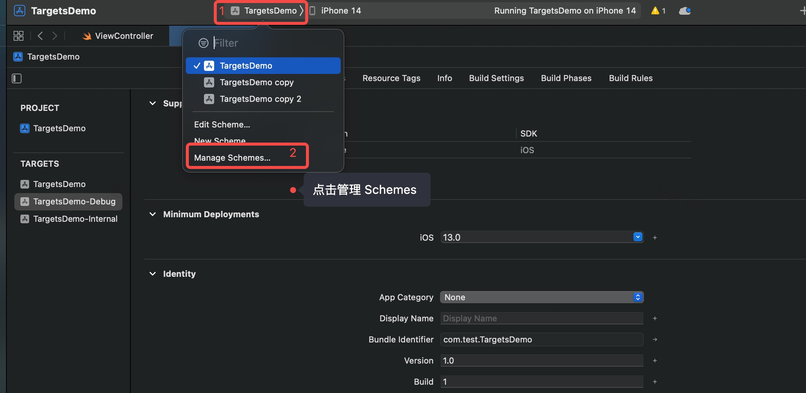

# 一、配置准备：如何搭建多环境支持，为 App 开发作准备


<!-- more -->

在开始之前，我先问你几个问题，在测试的时候，App 一般需要连接测试服务器，那么在上架后，还需要连生产服务器吗？在发布前，你的 App 需要通过 `Ad-hoc `分发给内部测试组吗？在发布到 `App Store` 的时候，你的 App 需要同时支持免费版和收费版吗？

如果你的回答是`“是”`，那么你的 App 就需要搭建多环境支持，优化开发的工作流程。多环境提供很多好处，比如能基于同一套源代码自动构建出有差异功能的 App；能支持多个团队并行开发，也能分离测试和生产环境，提高产品的迭代速度，保证上架的 App 通过严格测试和功能验证。

在 Moments App 项目中，我们就使用了三个不同的环境，分别是`开发环境`，`测试环境`和`生产环境`。它们到底有什么区别呢？

* **开发环境**， 用于日常的开发，一般有未完成的功能模块。编译时，也不进行任何优化，可以打印更多的日志，帮助开发者快速定位问题。

* **测试环境**， 主要是用于测试，以及为产品经理进行功能验证，包括部分完成的功能模块，也提供一些隐藏功能，方便我们进行开发和迭代，例如快速切换用户，清理 Cache，连接到不同后台服务器等等。

* **生产环境**， 只包含通过了测试并验证过的功能模块，它是最终提交到 App Store 供终端用户使用的版本。

多环境支持需要用到 Xcode 的构建配置，这一讲，我就结合 Moments App 项目来聊聊这个问题。

## Xcode 构建基础概念

一般在构建一个 iOS App 的时候，需要用到 `Xcode Project`，`Xcode Target`，`Build Settings`，`Build Configuration` 和 `Xcode Scheme` 等构建配置。它们各有什么用呢？

### Xcode Project

`Xcode Project`用于组织源代码文件和资源文件。一个 Project 可以包含多个 Target，例如当我们新建一个 Xcode Project 的时候，它会自动生成 App 的主 Target，Unit Test Target 和 UI Test Target。

在 Moments App 项目中，主 Target 就是 Moments，Unit Test Target 是 MomentsTests， UI Test Target 就是 MomentsUITests。


### Xcode Target

`Xcode Target`用来定义如何构建出一个产品（例如 `App`， `Extension` 或者 `Framework`），Target 可以指定需要编译的源代码文件和需要打包的资源文件，以及构建过程中的步骤。

例如在我们的 Moments App 项目中，负责单元测试的MomentsTestsTarget 就指定了 14 个测试文件需要构建（见下图的 Compile Sources），并且该 Target 依赖了主 App TargetMoments（见下图的 Dependencies）。


有了 Target 的定义，构建系统就可以读取相关的源代码文件进行编译，然后把相关的资源文件进行打包，并严格按照 Target 所指定的设置和步骤执行。那么 Target 所指定的设置哪里来的呢？来自 Build Settings。

### Build Settings

`Build Setting`保存了构建过程中需要用到的信息，它以一个变量的形式而存在，例如所支持的设备平台，或者支持操作系统的最低版本等。

通常，一条 Build Setting 信息由两部分组成：名字和值。比如下面是一条 Setting 信息，`iOS Development Target`是名字，而`iOS 14.0`是值。


有了这些基础知识以后，接下来我就结合 Moments App 来和你介绍下如何进行多环境配置，从而生成不同环境版本的 App。

## Moments App 构建配置

一般用 Xcode 编译出不同环境版本的 App 有多种办法，例如拷贝复制所有源代码，建立多个 Target 来包含不同的源码文件等等。不过，在这里我推荐使用 `Build Configuration` 和 `Xcode Scheme` 来管理多环境，进而构建出不同环境版本的 App。为什么？因为这两个是目前管理成本最低的办法。接下来我一一介绍下。

### Build Configuration

当我们在 Xcode 上新建一个项目的时候，Xcode 会自动生成两个 Configuration：`Debug`和`Release`。Debug 用于日常的本地开发，Release 用于构建和分发 App。而在我们的 Moments App 项目中，有三个 configuration：`Debug`，`Internal` 和 `AppStore`。它们分别用于构建`开发环境`、`测试环境`和`生产环境`。 其中 Internal 和 AppStore 是从自动生成的 Release 拷贝而来的。


那什么是 Build Configuration 呢？

`Build Configuration`就是一组 Build Setting。 我们可以通过 Build Configuration 来分组和管理不同组合的 Build Setting 集合，然后传递给 Xcode 构建系统进行编译。

有了 Build Configuration 以后，我们就能为同一个 Build Setting 设置不同的值。例如`Build Active Architecture Only`在 Debug configuration 是`Yes`，而在 Internal 和 AppStore configuration 则是`No`。这样就能做到同一份源代码通过使用不同的 Build Configuration 来构建出功能不一样的 App 了。


那么，在构建过程中怎样才能选择不同的 Build Configuration 呢？答案是使用 Xcode Scheme。

### Xcode Scheme

`Xcode Scheme`用于定义一个完整的构建过程，其包括指定哪些 Target 需要进行构建，构建过程中使用了哪个 Build Configuration ，以及需要执行哪些测试案例等等。在项目新建的时候只有一个 Scheme，但可以为同一个项目建立多个 Scheme。不过这么多 Scheme 中，同一时刻只能有一个 Scheme 生效。

我们一起看一下 Moments App 项目的 Scheme 吧。 Moments App 项目有三个 Scheme 来分别代表三个环境，`Moments Scheme` 用于开发环境，`Moments-Internal Scheme` 用于测试环境，而 `Moments-AppStore Scheme` 用于生产环境。


下面是`MomentsScheme` 的配置。


左边是该 Scheme 的各个操作，如当前选择了 Build 操作；右边是对应该操作的配置，比如 Build 对应的 Scheme 可以构建三个不同的 Targets。不同的 Scheme 所构建的 Target 数量可以不一样，例如下面是`Moments-InternalScheme` 的配置。


该 Scheme 只构建主 App TargetMoments，而不能构建其他两个测试 Target。

当我们选择 Run、Test、Profile、 Analyze 和 Archive 等操作时，在右栏有一个很关键的配置
叫作 Build Configuration，我们可以通过下拉框来选择 Moments App 项目里面三个 Configuration （Debug，Internal 和 AppStore） 中的其中一个。


为了方便管理，我们通常的做法是，一个 `Scheme` 对应一个 `Configuration`。有了这三个 Scheme 以后，我们就可以很方便地构建出 `Moments α（开发环境）`，`Moments β（测试环境`）和 `Moments（生产环境）`三个功能差异的 App。


你可能已经注意到这三个 App 的名字都不一样，怎么做到的呢？实际上是我们为不同的 Configuration 设置了不一样的 Build Setting。其中决定 App 名字的 Build Setting 叫作`PRODUCT_BUNDLE_NAME`，然后在 `Info.plist` 文件里面为 `Bundle name` 赋值，就能构建出名字不一样的 App。


为了构建出不同环境版本的 App，我们需要经常为各个 Build Configuration 下的 Build Setting 设置不一样的值。 在这其中，使用好 xcconfig 配置文件就显得非常重要。

## xcconfig 配置文件

xcconfig 会起到什么作用呢？

一般修改 Build Setting 的办法是在 Xcode 的 Build Settings 界面上进行。 例如下面的例子中修改 Suppress Warnings。


这样做有一些不好的地方，首先是手工修改很容易出错，例如有时候很难看出来修改的 Setting 到底是 Project 级别的还是 Target 级别的。其次，最关键的是每次修改完毕以后都会修改了 xcodeproj 项目文档 （如下图所示），导致 Git 历史很难查看和对比。


幸运的是，Xcode 为我们提供了一个统一管理这些 Build Setting 的便利方法，那就是使用 xcconfig 配置文件来管理。

### xcconfig 概念及其作用

`xcconfig`也叫作 `Build configuration file（构建配置文件）`，我们可以使用它来为 Project 或 Target 定义一组 Build Setting。由于它是一个纯文本文件，我们可以使用 Xcode 以外的其他文本编辑器来修改，而且可以保存到 Git 进行统一管理。 这样远比我们在 Xcode 的 Build Settings 界面上手工修改要方便很多，而且还不容易出错。

在 xcconfig 文件里面的每一条 Setting 都是下面的格式：

```js
BUILD_SETTING_NAME = value
```

其中，`BUILD_SETTING_NAME`表示 Build Setting 的名字，而value是该 Setting 的值。下面是一个例子。

```js
SWIFT_VERSION = 5.0
```

`SWIFT_VERSION`是用于定义 Swift 语言版本的 Build Setting，其值是`5.0`。Setting 的名字都是由大写字母，数值和下划线组成。这种命名法我们一般称为`蛇型命名法`，例如`SNAKE_CASE_NAME`。

当我们使用 xcconfig 时，Xcode 构建系统会按照下面的优先级来计算出 Build Setting 的最后生效值：

1. **Platform Defaults** (平台默认值)

2. **Xcode Project xcconfig File**（Project 级别的 xcconfig 文件）

3. **Xcode Project File Build Settings**（Project 级别的手工配置的 Build Setting）

4. **Target xcconfig File** （Target 级别的 xcconfig 文件）

5. **Target Build Settings**（Target 级别的手工配置的 Build Setting）

Xcode 构建系统会按照上述列表从上而下读取 Build Setting，如果发现同样的 Setting ，就会把下面的 Setting 覆盖掉上面的，越往下优先级别越高。

例如我们在 Project 级别的 xcconfig 文件配置了`SWIFT_VERSION = 5.0`而在Target 级别的 xcconfig 文件配置了`SWIFT_VERSION = 5.1`，那么Target 级别的 Build Setting 会覆盖 Project 级别的`SWIFT_VERSION`设置，最终`SWIFT_VERSION`生效的值是`5.1`。

那么，要怎样做才能做到不覆盖原有的 Build Setting 呢？我们可以使用下面例子中的`$(inherited)`来实现。

```js
BUILD_SETTING_NAME = $(inherited) additional value
```

可以保留原先的 Setting，然后把新的值添加到后面去。比如：

```js
FRAMEWORK_SEARCH_PATHS = $(inherited) ./Moments/Pods
```

其中的`FRAMEWORK_SEARCH_PATHS`会保留原有的值，然后加上`./Moments/Pods`作为新值。
在配置 Build Setting 时，还可以引用其他已定义的 Build Setting。

例如下面的例子中，`FRAMEWORK_SEARCH_PATHS`使用了另外一个 Build Setting `PROJECT_DIR`。

```js
FRAMEWORK_SEARCH_PATHS = $(inherited) $(PROJECT_DIR)
```

为了重用，我们可以通过`#include`引入其他 xcconfig 文件。

```js
#include "path/to/OtherFile.xcconfig"
```

### Moments App xcconfig 配置文件

下面我们一起来看看 Moments App 项目是怎样管理 xcconfig 配置文件吧。


我们把所有 xcconfig 文件分成三大类：`Shared`、 `Project` 和 `Targets`。

其中 Shared 文件夹用于保存分享到整个 App 的 Build Setting，例如 Swift 的版本号、App 所支持的 iOS 版本号等各种共享的基础信息。 下面是 `SDKAndDeviceSupport.xcconfig` 文件里面所包含的信息：

```js
TARGETED_DEVICE_FAMILY = 1
IPHONEOS_DEPLOYMENT_TARGET = 14.0
```

`TARGETED_DEVICE_FAMILY`表示支持的设备，`1`表示 `iPhone`。
而`IPHONEOS_DEPLOYMENT_TARGET`表示支持 iOS 的最低版本，我们的 Moments App 所支持的最低版本是 `iOS 14.0`。

Project 文件夹用于保存 Xcode Project 级别的 Build Setting，其中 BaseProject.xcconfig 会引入 Shared 文件夹下所有的 xcconfig 配置文件，如下所示：

```js
#include "CompilerAndLanguage.xcconfig"
#include "SDKAndDeviceSupport.xcconfig"
#include "BaseConfigurations.xcconfig"
```

然后我们会根据三个不同的环境分别建了三个xcconfig 配置文件，如下：

* DebugProject.xcconfig 文件

```js
#include "BaseProject.xcconfig"
SWIFT_ACTIVE_COMPILATION_CONDITIONS = $(inherited) DEBUG
```

* InternalProject.xcconfig 文件

```js
#include "BaseProject.xcconfig"
SWIFT_ACTIVE_COMPILATION_CONDITIONS = $(inherited) INTERNAL
```

* AppStoreProject.xcconfig 文件

```js
#include "BaseProject.xcconfig"
SWIFT_ACTIVE_COMPILATION_CONDITIONS = $(inherited) PRODUCTION
```

它们的共同点是都引入了用于共享的 BaseProject.xcconfig 文件，然后分别定义了 Swift 编译条件配置`SWIFT_ACTIVE_COMPILATION_CONDITIONS`。其中`$(inherited)`表示继承原有的配置，`$(inherited)`后面的`DEBUG`或者`INTERNAL`表示在原有配置的基础上后面添加了一个新条件。有了这些编译条件，我们就可以在代码中这样使用：

```js
#if DEBUG
    print("Debug Environment")
#endif
```

该段代码只在开发环境执行，因为只有开发环境的`SWIFT_ACTIVE_COMPILATION_CONDITIONS`才有`DEBUG`的定义。这样做能有效分离各个环境，保证同一份代码构建出对应不同环境的 App。

Targets 文件夹用于保存 Xcode Target 级别的 Build Setting，也是由一个 BaseTarget.xcconfig 文件来共享所有 Target 都需要使用的信息。

```js
PRODUCT_BUNDLE_NAME = Moments
```

这里的`PRODUCT_BUNDLE_NAME`是 App 的名字。
下面是三个不同环境的 Target xcconfig 文件。

* DebugTarget.xcconfig

```js
#include "../Pods/Target Support Files/Pods-Moments/Pods-Moments.debug.xcconfig"
#include "BaseTarget.xcconfig"
PRODUCT_BUNDLE_NAME = $(inherited) α
PRODUCT_BUNDLE_IDENTIFIER = com.ibanimatable.moments.development
```

* InternalTarget.xcconfig

```js
#include "../Pods/Target Support Files/Pods-Moments/Pods-Moments.internal.xcconfig"
#include "BaseTarget.xcconfig"
PRODUCT_BUNDLE_NAME = $(inherited) β
PRODUCT_BUNDLE_IDENTIFIER = com.ibanimatable.moments.internal
```

* AppStoreTarget.xcconfig

```js
#include "../Pods/Target Support Files/Pods-Moments/Pods-Moments.appstore.xcconfig"
#include "BaseTarget.xcconfig"
PRODUCT_BUNDLE_NAME = $(inherited)
PRODUCT_BUNDLE_IDENTIFIER = com.ibanimatable.moments
```

它们都需要引入 CocoaPods 所生成的 xcconfig 和共享的 BaseTarget.xcconfig 文件，然后根据需要改写 App 的名字。例如DebugTarget 覆盖了`PRODUCT_BUNDLE_NAME`的值为`Moments α*`, 其所构建的 App 叫作`Moments α`。

一般在 App Store 上所有 App 的标识符都必须是唯一的。如果你的项目通过 Configuration 和 Scheme 来生成免费版和收费版的 App，那么，你必须在两个 Configuration 中分别为`PRODUCT_BUNDLE_IDENTIFIER`配置对应的标识符，例如`com.lagou.free`和`com.lagou.paid`。

在 Moments App 中，我们也为各个环境下的 App 使用了不同的标识符，以方便我们通过 CI 自动构建，并分发到内部测试组或者 App Store。同时，这也能为各个环境版本的 App 分离用户行为数据，方便统计分析。

一旦有了这些 xcconfig 配置文件，今后我们就可以在 Xcode 的 Project Info 页面里的 Configurations 上引用它们。


下面是所有 Configurations 所引用的 xcconfig 文件。


在配置好所有 xcconfig 文件的引用以后，可以在 Build Settings 页面查看某个 Build Setting 的生效值。我们以`IPHONEOS_DEPLOYMENT_TARGET`为例，一起看看。


当我们选择`All`和`Levels`时，可以看到所有配置信息分成了不同的列。这些列分别代表前面的 Build Setting 优先级：

1. 平台默认值

2. Project 级别的 xcconfig 文件

3. Xcode 项目文件中的 Project 级别配置

4. Target 级别的 xcconfig 文件

5. Xcode 项目文件中的 Target 级别配置

**Build Settng 的优先级是从左到右排序的。越是左边优先级就越高**。例如，我们在 Project 级别的 xcconfig 文件里面定义了`IPHONEOS_DEPLOYMENT_TARGET`的值为14.0，那么Project 级别的 xcconfig 文件（Project Config File） 一列上就会显示iOS 14.0，它覆盖了系统的默认值 （iOS Default）iOS 14.2。这就是因为 Project 级别的 xcconfig 文件，它的优先级高于系统默认值，因此最后生效的值是iOS 14.0。

## 总结

本讲我介绍了如何通过 Build Configuration、 Xcode Scheme 以及 xcconfig 配置文件来统一项目的构建配置，从而搭建出多个不同环境，为后期构建出对应环境的 App 做准备。


在使用 xcconfig 配置时，还是需要注意以下两点：

* **首先**，我们必须把所有 Build Setting 都配置在 xcconfig 文件里面，并通过 Git 进行统一管理；

* **其次**，我们千万不要在 Xcode 的 Build Settings 页面修改任何 Setting，否则该配置会覆盖 xcconfig 文件里面的配置。如果你不小心修改了，可以通过点击删除键把页面是的配置删掉。

### 源码地址：

>https://github.com/lagoueduCol/iOS-linyongjian/tree/main/Moments/Moments/Configurations


# 二、学习笔记与扩展

## Swift 多个 Target 的管理与配置

### 1、创建多个 Target

创建一个新的Swift工程，并 `Duplicate` 多个Target。

(1)、`Duplicate` 复制 Target：


(2)、可以生成了新的 target 和 info.plist 文件：


(3)、修改 target 名字：


此处：

* `TargetsDemo` ：为正式环境 target
* `TargetsDemo-Debug` ：为开发环境 target
* `TargetsDemo-Internal` ：为测试环境 target

(4)、配置 Schemes：




修改成功如下：


### 2、配置工程相关信息

我们现在已经有了三个Target，接下来我们为他们命名不同地 `Display Name` 、`Bundle Identifier`，并引入不同的 `Assets.xcassets`资源以生成和管理不同的app。


为不同的 app 引入不同的 `Assets.xcassets` 图片资源。


然后导入图片即可：


不同图片资源的使用可以自主选择：


### 3、宏定义配置

虽然是swift，我们还是叫它宏定义。接下来我们为不同的 target 设置不同的宏定义以区分它们，然后在代码中引用。

找到设置路径：


以下是 swift 情况下三种 “宏定义” 的配置方式：

* 分开写，加引号，加 -D

```
“-D”
“APPSTORE”
```

* 分开写，不加引号，加 -D

```
-D
APPSTORE
```

* 写成一排，不加引号，加 -D

```
-DAPPSTORE
```

三种方式任选其一即可：


分别为 target 设置 “宏定义” 之后，我们就可以在代码中使用了：


### 4、Podfile 设置

如果不同的 target 需要引入不同三方库，可以在`podfile` 文件中进行设置：

```js
# Uncomment the next line to define a global platform for your project
platform :ios, '13.0'

# 正式环境
target 'TargetsDemo' do
  use_frameworks!

  pod 'SnapKit'

end

# 开发环境，使用 SwiftLint 进行代码规范检测，SwiftGen 自动生成资源管理文件
target 'TargetsDemo-Debug' do
  use_frameworks!

  pod 'SwiftLint', '= 0.42.0', configurations: ['Debug']
  pod 'SwiftGen', '= 6.4.0', configurations: ['Debug']

end

# 测试环境，引用单元测试三方库
target 'TargetsDemo-Internal' do
  use_frameworks!

  pod 'Quick', '= 3.0.0'
  pod 'Nimble', '= 9.0.0'
  pod 'RxTest', '= 5.1.1'
  pod 'RxBlocking', '= 5.1.1'

end
```


