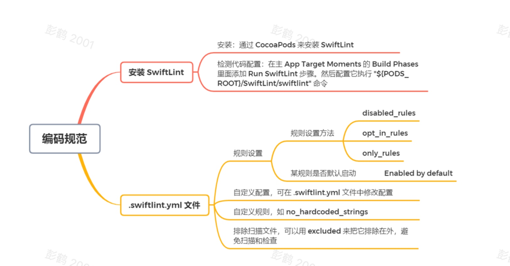
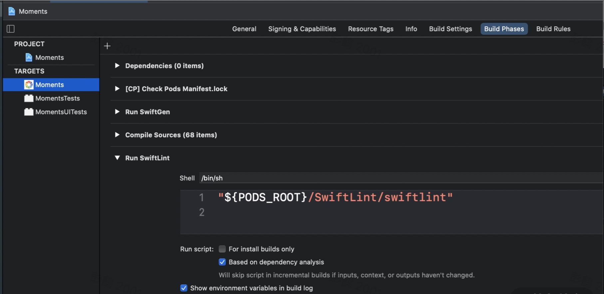
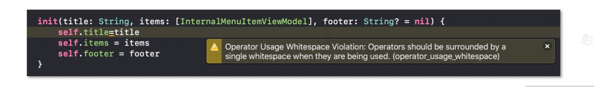
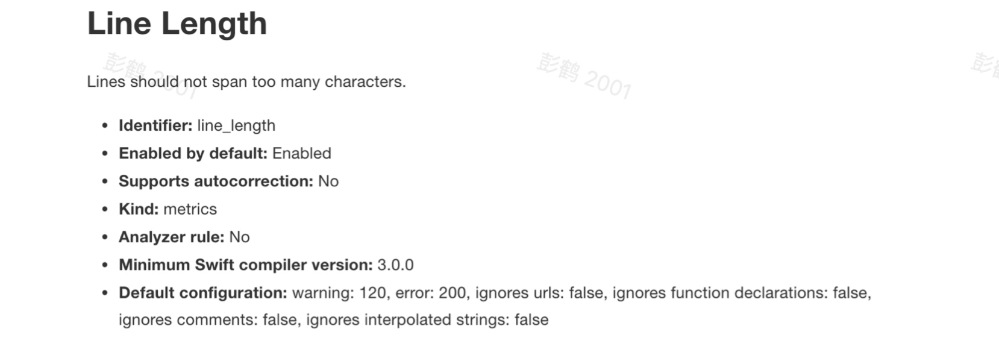
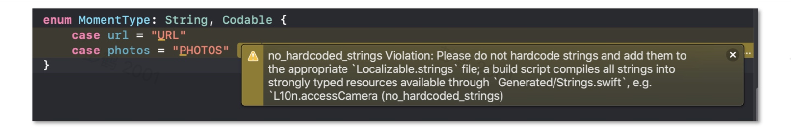

# 编码规范：如何使用 SwiftLint 统一编码规范？



<!-- more -->

在软件开发领域有很多有趣且重要的话题，比如使用什么样的系统架构来让代码更容易维护，使用哪些第三方库能提高开发效率，等等。但也有一些话题不仅无趣，还很难得出结论，比如像下面这行变量定义，里面的空格哪个正确？

```js
let name: String = "Jake"
let name : String = "Jake"
let name :String = "Jake"
let name: String= "Jake"
let name: String="Jake"
```

还有代码缩减，到底是用 2 个空格还是 4 个？这就像豆浆到底是喝甜的还是喝咸的一样，并没有标准答案。也因此，出现了许多永无休止的讨论。特别是当新成员所提交的代码风格，与团队其他成员有很大的区别时，往往会出现沟通与协作问题，甚至发生争执而影响工作。此时，团队如果有一套统一的编码规范，那么这样的问题就很容易解决。

除了能促进沟通协作，一套统一的编码规范还能降低代码维护的成本和减少 Bug 的数量。此外，由于规范往往由团队资深开发者指定并不断完善，也有助于其他团队成员快速成长。

既然统一的编码规范由那么多优点，那么我们如何在团队中实施统一编码规范呢？在 iOS 开发领域，使用 SwiftLint 能有效地建立和改进 Swift 项目的编码规范。接下来我就和你聊聊这方面的内容。

## 安装 SwiftLint

安装 `SwiftLint` 的方式有很多种，例如使用 `Homebrew`，`Mint`，下载 SwiftLint.pkg 安装包等等。但我只推荐 `CocoaPods` 这一种方法，因为通过 CocoaPods 可以有效地管理 SwiftLint 的版本，从而保证团队内各个成员都能使用一模一样的 SwiftLint 及其编码规范。

通过 CocoaPods 来安装 SwiftLint 非常简单。在 Moments App 项目中，我们在`Podfile`文件中添加`SwiftLint Pod` 即可。

```js
pod 'SwiftLint', '= 0.41.0', configurations: ['Debug']
```

由于我们只在开发环境下使用 SwiftLint，因此配置了只有`Debug`的 `Build Configuration` 才生效。

为了每次编译完都使用 SwiftLint 来检查代码，我们需要在主 App TargetMoments的 `Build Phases` 里面添加`Run SwiftLint`步骤。然后配置它执行`"${PODS_ROOT}/SwiftLint/swiftlint"`命令。



这里要注意，由于 SwiftLint 的设计是检查有效的 Swift 代码（编译通过的代码就是有效的代码），我们需要把`Run SwiftLint`步骤放在`Compile Source`步骤之后。否则 SwiftLint 可能会反馈一些错误的结果。

有了上面的配置以后，每次编译程序， SwiftLint 都会自动执行检查，我们可以在 Xcode 上修正这些警告信息来保证编码规范的统一。



例如上面的截图所示，SwiftLint 告诉我们空格的使用不正确。

那么，这些警告信息到底怎样来的呢？我们一起看看`.swiftlint.yml`文件吧。

## .swiftlint.yml 文件

当我们执行 `SwiftLint` 命令时，它会自动帮我们启动一堆编码规则，并扫描和检查我们的项目。这些规则有`comma`（逗号前后的空格处理），`private_over_fileprivate`（优先使用 priviate），`force_cast`（避免强制转型）等等 。详细规则列表你也可以在 [SwiftLint 官网](https://realm.github.io/SwiftLint/rule-directory.html) 找到。

但正如 SwiftLint 的作者所说： *“规则存在，但并不意味着你必须用它”*。我们需要根据团队自身的情况和成员的统一意见，来决定需要启动和关闭哪些规则。此时，就需要用到 `.swiftlint.yml` 文件了。

`.swiftlint.yml`主要用于启动和关闭 SwiftLint 所提供的规则，以及自定义配置与规则。一旦我们有了 .swiftlint.yml 文件以后，SwiftLint 在执行过程中会严格按照该文件的定义来扫描和检查代码。由于 .swiftlint.yml 是一个纯文本文件，我们可以通过 Git 统一管理，这样能保证整个团队在执行 SwiftLint 的时候都会得到一模一样的效果，从而保证了整个团队代码规范的一致性。

### 规则设置

SwiftLint 提供了`disabled_rules`,`opt_in_rules`和`only_rules`三种规则设置方法。其中，`disabled_rules`能帮我们关闭默认生效的规则，而`opt_in_rules`可以启动默认关闭的规则。

另外，SwiftLint 所提供的每条规则都有一个叫作`Enabled by default`的属性来表示该规则是否默认启动。例如`class_delegate_protocol`规则是默认启动的，而`array_init`规则是默认关闭的。

```js
disabled_rules:
  - class_delegate_protocol
opt_in_rules:
  - array_init
```

上面的配置表示，关闭默认生效的`class_delegate_protocol`，并同时启动`array_init`。

虽然使用`disabled_rules`和`opt_in_rules`能够完成配置，但我不推荐你使用它们 ，而是用`only_rules`来定义每条生效的规则。

我们在 Moments App 项目中也使用了`only_rules`。你可以在 [代码仓库](https://github.com/lagoueduCol/iOS-linyongjian/blob/main/Moments/.swiftlint.yml) 找到该 `.swiftlint.yml` 文件来查看项目启动的所有规则。由于`only_rules`是 `SwiftLint 0.41.0` 引入的，如果你需要以前版本，可以使用`whitelist_rules`来替代。下面是 .swiftlint.yml 文件中的部分规则。

```js
only_rules:
  - array_init
  - attributes
  - block_based_kvo
  - class_delegate_protocol
  - closing_brace
```

通过`only_rules`，我们可以把每一条规则明确添加到 SwiftLint 里面。这样能保证我们整个团队都使用一致的规则，而不会像使用`disabled_rules`和`opt_in_rules`那样，随着 SwiftLint 默认规则的改变，导致最终启动的规则不一样。

### 自定义配置

在我们配置一条规则的时候，为了符合团队自身的情况，可以修改其默认配置。例如`line_length`的默认配置是当一行代码多于 120 个字符的时候会报告编译警告，而多于 200 个字符的时候报告编译错误。



我们可以在 .swiftlint.yml 文件中修改这些配置。

```js
line_length: 110
file_length:
  warning: 500
  error: 1200
```

上述的配置表示我们修改了`line_length`的配置，当一行代码多于 110 个字符（而不是默认的 120 个字符）时就会报告编译警告。我们也可以同时覆盖编译警告和编译错误的配置，例如把`file_length`的编译警告改成 500，而编译错误改成 1200。

### 自定义规则

除了 SwiftLint 所提供的默认规则以外，我们还可以自定义规则。例如在 Moments App 项目中，我就自定义了**“不能硬编码字符串”**的规则，具体如下：

```js
custom_rules:
  no_hardcoded_strings:
    regex: "([A-Za-z]+)"
    match_kinds: string
    message: "Please do not hardcode strings and add them to the appropriate `Localizable.strings` file; a build script compiles all strings into strongly typed resources available through `Generated/Strings.swift`, e.g. `L10n.accessCamera"
    severity: warning
```

该规则`no_hardcoded_strings`会通过正则表达式来检查字符串是否进行了硬编码。如果是SwiftLint 会根据我们的自定义规则显示警告信息，如下图所示。



### 排除扫描文件

默认情况下 SwiftLint 会扫描和检查整个项目的所有代码。因为一些第三方依赖库的源码风格可能和我们团队的风格不一致，为了方便使用第三方依赖库，我们可以用`excluded`来把它排除在外，避免扫描和检查。示例如下：

```js
excluded:
  - Pods
```

现在我们已经通过配置 .swiftlint.yml 文件来帮助我们统一编码规范了。

## 总结

在这一讲，我介绍了如何使用 SwiftLint 来统一编码规范。特别是其中的`only_rules`，我们要使用它来定义需要生效的规则。


此外，在制定编码规范时，我们还需要注意以下几点。

* **首先**，所制定的规范要和业界标准同步，这能让新成员接手代码时，更容易接受而不是反驳。一个建议是，你可以从 SwiftLint 所提供的默认规则开始，毕竟这些规则都是通过许多人沟通和完善下来的，比你独自一人想出来要靠谱得多。

* **其次**，在制定规范时，重点是提高代码的可读性，而不是为了高大上去使用黑魔法或者选择那些不常用功能等。这样可以让团队绝大部分成员更容易理解和遵循这些规范。

* **最后要强调的是**，一套编码规范是需要不断迭代和完善的，我建议团队要定时 `Retro（Retrospective，敏捷回顾）`，讨论和优化这些规范，让得大家都有机会贡献到规范中，增加他的认同感。这种做法在多团队平行开发的环境下特别有效。

### 源码地址：

>swiftlint.yml 文件
https://github.com/lagoueduCol/iOS-linyongjian/blob/main/Moments/.swiftlint.yml