# 如何统一设计规范，提高沟通效率？

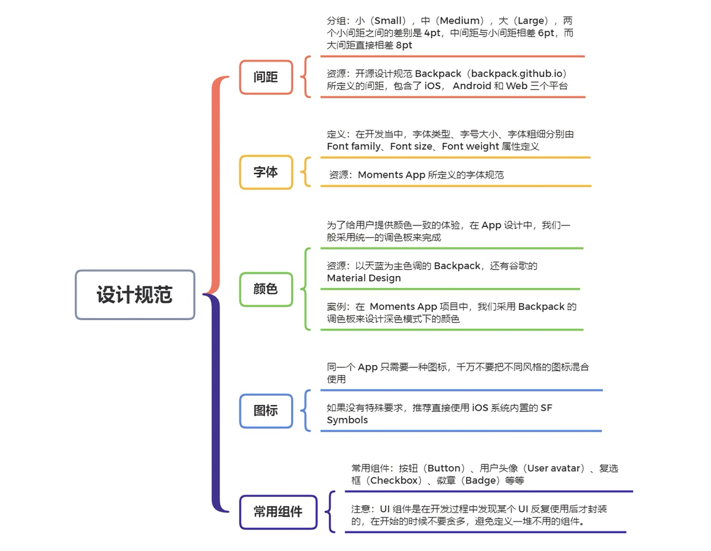

<!-- more -->

作为 iOS 工程师，我们开发的绝大部分功能都是与 *用户界面* 和 *用户交互* 有关。所以，和设计师协调沟通也成了我们的日常工作之一。在这个过程中，就免不了和他们争论有关 **间距大小、字体粗细、字号大小、颜色深浅** 等问题。想必有时候你也很烦恼，怎么和这些设计师们沟通就那么麻烦呢！

其实，这些问题都可以用一套统一的 *设计规范* 来解决，从而有效降低沟通成本。有了规范，设计师可以根据明确的指引和预定义好的设计元素，来设计出新的界面；而开发者也能使用预先封装好的、可重用的设计组件实现快速开发。最后，开发的产品为用户提供一致的体验。

那一套统一的设计规范到底是怎样的呢？它通常包括 **间距、字体、颜色、图标和常用组件** 等，这一讲，我们就一起看看怎样定义这些设计规范吧。

## 间距

**间距（Spacing）**，是父子组件之间、以及平级组件之间的留白，合理使用间距能有效分离和组织内容，也能保证页面风格一致，提升用户体验。

但是，在实际工作当中，你有没有遇到过打开设计师给的设计稿后发现，同一个界面里的间距定义杂乱无章，不同页面类似组件的间距也大不相同，这样导致的结果是，开发出的 App 在视觉上会给人风格混乱的感觉。

那怎样定义统一的间距呢？其实很简单，我们只保留几个可用的间距，并给它们赋予定义，下面是我们 Moments App 的间距定义。

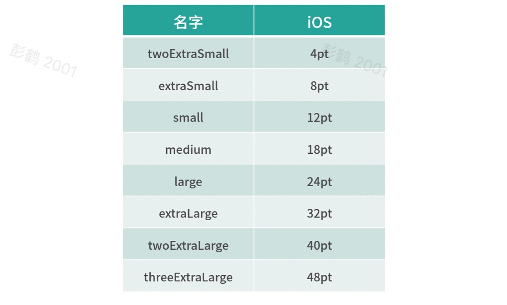

根据我们的经验，在选择间距的值时，为了具有和谐感，我们把间距分成三组：**小（Small）、中（Medium）、大（Large）**。两个 *小间距* 之间的差别是 `4pt`， *中间距* 与 *小间距* 相差 `6pt`，而 *大间距* 直接相差 `8pt`，给用户一种循序渐进的感觉。这些间距的定义能覆盖 App 所有的使用需求了。

有了统一的间距定义，设计师就可以在设计稿里面标注间距的定义，而不是具体的值。开发者也可以通过代码中原先定义好的间距，而无须每次都 *硬编码（Hardcode）* 间距的值。

除了 iOS 以外，统一的间距还可以用到 Android 和 Web 上，如下面是开源设计规范 Backpack 所定义的间距，其包含了 `iOS`、 `Android` 和 `Web` 三个平台。

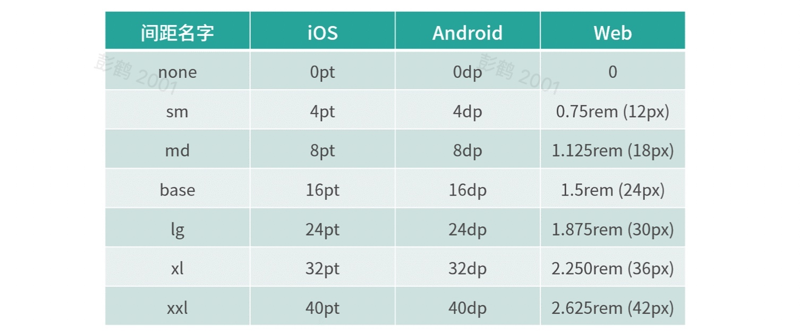

有了这些间距的定义以后，设计师只需设计一份设计稿，不同平台的开发者都可以使用同一份设计稿进行开发。

## 字体

任何一款 App，都离不开文字，除了其本身传达信息，文字的各种样式，包括 **字体类型、大小、粗细** ，在其中也承担着重要角色。比如合理使用行楷会给人美感；字体放大可以暗示优先阅读；字体加粗，会起到强调的作用，吸引用户关注等等。

在开发当中， *字体类型、字号大小、字体粗细* 分别由 `Font family`、`Font size`、`Font weight` 属性定义。除非有特殊的原因（如品牌需要，或者为了增强游戏体验），iOS 的 App 一般都使用 iOS 系统所自带的字体系列。这样更能符合用户的阅读习惯。在自带的字体系列的基础上，通过把字号大小和字体粗细组合起来定义一些字体类型。下面是我们 Moments App 所定义的字体规范。

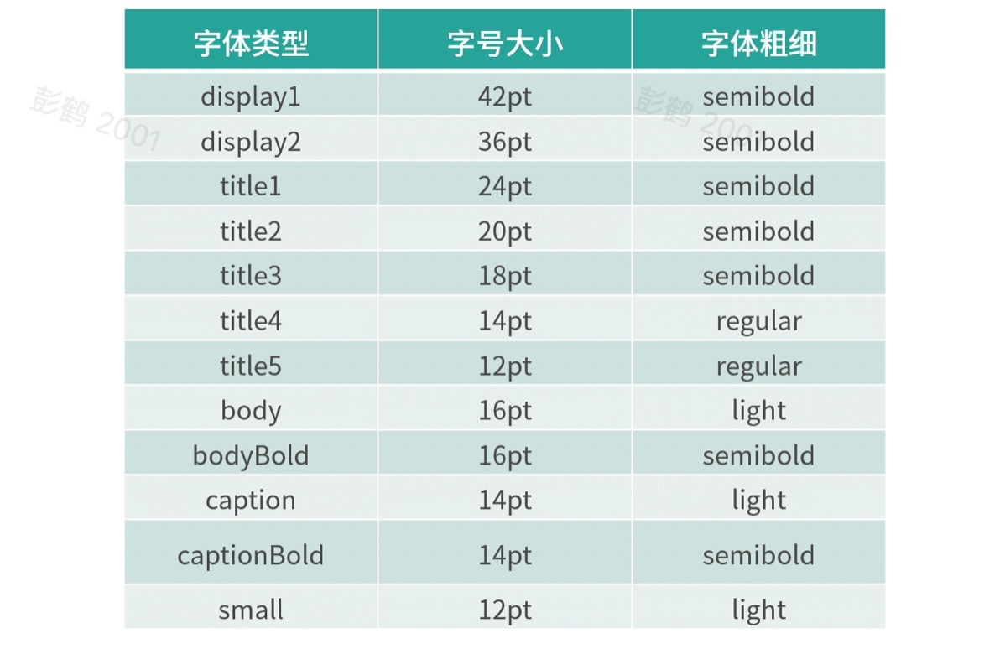

根据字体类型的时候，我们分成四组：

* **大标题（Display）**，用于显示这个页面的唯一标题，使用特大字号（如 `42pt` 和 `36pt`）；

* **标题（Titile）**，用于显示段落的标题，我们提供了五种不同的段落标题，其字号由大变小；

* **文本（Body）**，用于显示一般的内容文本，我们提供了普通和加粗两种类型来呈现不同的文本；

* **小文本（Small text）**，使用较小的字体来显示辅佐内容，例如 *备注、版本信息* 等。

为了让读者有更好的阅读体验，我们在字体粗细上都统一选择了偏细的字重，比如使用 `semibold` 而不是 `bold` ，并且选择 `light` 而不是 `regular` 来定义这套字体。

有了这些字体类型的定义，设计师可以很方便地选择字体，比如在设计文章内容部分时，可以从 `body` 或者 `bodyBold` 中选择出来，而不需要思考到底是使用 `14pt`、`15pt` 还是 `16pt`。同时，开发者也可以使用原先定义好的字体组件，提升效率。

除此之外，还有 **动态字体**，因为我们在此之前已经对字体的类型、大小、粗细做了定义，设计师只需要做一个设计稿就行了，无须为不同的字体设计出不同的版本，而我们开发者只需要通过封装好的字体组件来支持即可。**具体如何封装字体组件，我会在第 12 讲详细介绍。**

## 颜色

在一款 App 的视觉体验中，颜色毫无疑问在其中占据很重要的位置。如果颜色搭配不当，很容易被用户吐槽甚至弃用。所以设计之初，就要对颜色做好规范。

为了给用户提供颜色一致的体验，在 App 设计中，我们一般采用统一的 *调色板（Color palette）* 来完成。在实际工作当中，你可以和设计师一起在各类开源设计网站中寻找，比如，以天蓝为主色调的  *Backpack* ，还有谷歌的 *Material Design* 还提供了调色板生成工具，你可以根据自己品牌的颜色来生成一个调色板。

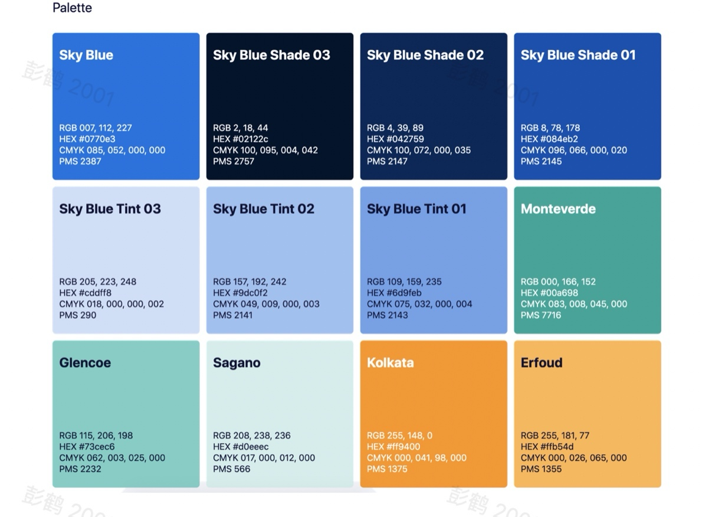

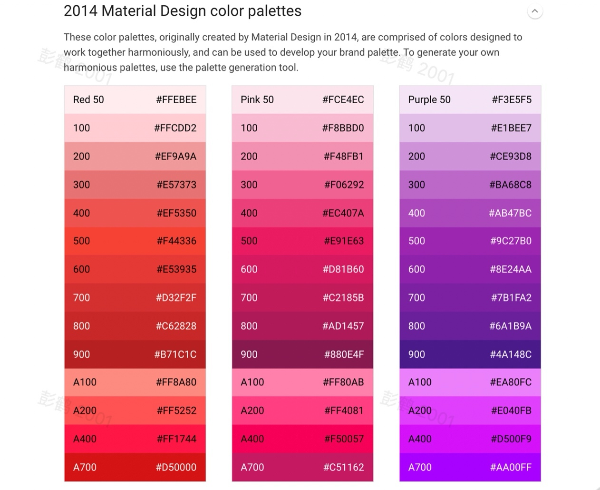

有了调色板，我们就可以在设计常用组件时（如按钮，卡片，警告信息等）使用调色板里面的颜色。例如  *Backpack*  的主色是天蓝色，在设计按钮时，主按钮的背景可以使用天蓝色（#0770e3）。

为了照顾不同用户的使用习惯，提高夜间视觉体验，iOS 系统在原有的浅色模式之外，还提供了深色模式。我们在设计调色板的时候，也最好考虑到对深色模式的支持。

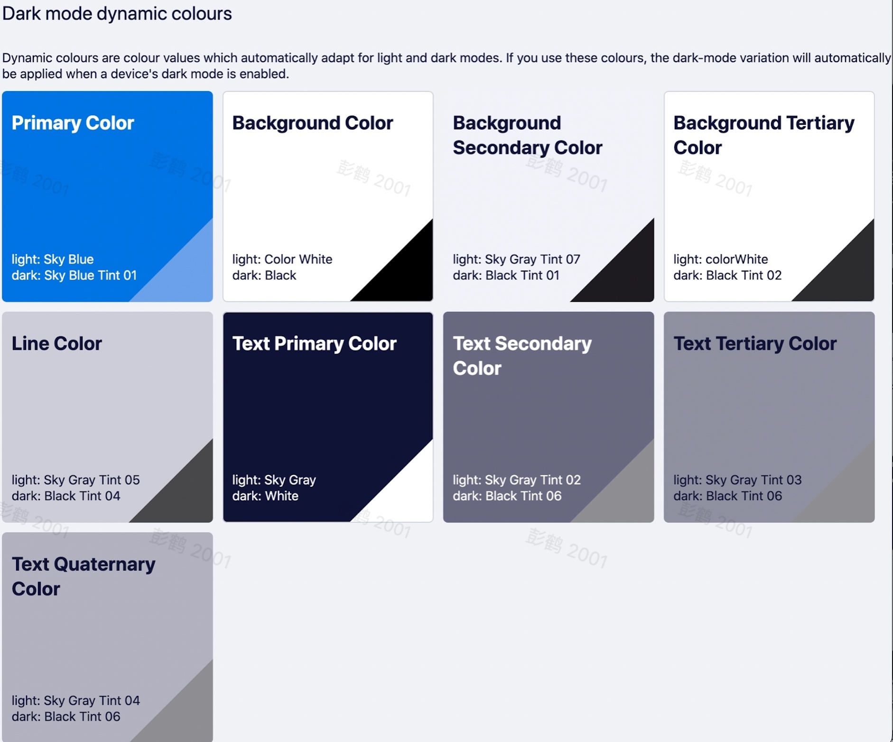

在  Moments App 项目中，我们采用 Backpack 的调色板来设计深色模式下的颜色。该调色板定义了一组语义化的颜色（`Semantic color`）供我们选择。比如设计师在选择背景颜色的时候可以根据需要从 *背景主色、背景副色、背景* 第三色中任选一个，Backpack 每种颜色都提供了 **浅色模式** 和 **深色模式** 两种类型，设计师在设计过程中就不需要为这两种模式制作不同的设计稿了，开发者也可以使用定义好的颜色组件来同时支持两种模式，不需任何额外的工作。

需要注意的是，在定义语义化颜色时要特别注意颜色之间的对比度，例如使用了 `Text Primary Color` 的文本在使用 `Background Color` 的背景下能容易阅读，而使用灰色的背景再使用黑色的文本会难以阅读。

如果你所在团队没有专门的设计师来定义这些颜色，也可以使用 iOS 提供的 **动态系统颜色（Dynamic System Colors）**，它为我们定义了同时支持 **浅色模式** 和 **深色模式** 的各种颜色。

## 图标

**图标（Iconography）**，在 App 设计中也承担重要的作用，它可以有效地把功能呈现给用户，例如一个 *加号（+）* 的图标能让用户知道点击的时候可以进行新增操作。图标也能简化界面的设计，让页面更加吸引用户，*例如在买房的 App 里面我们可以使用一辆车的图标表示多少个车位，一个浴缸的图标表示多少个洗手间*，这样能省去大量的文件描述。图标还能帮助用户导航。因此我们在设计 App 的时候也需要合理地使用图标。

如果你们公司没有专门的图标设计师，那么你可能会购买或者使用一些开源的图标。这里我有一些建议。

首先，**同一个 App 只需要一种图标，千万不要把不同风格的图标混合使用**。

其次，如果没有特殊要求，我推荐直接使用苹果公司提供的。具体来说，在 iOS 系统内置的 `SF Symbols`  为我们提供了 `3150` 个一致的、可定制的图标，如下面的例子。

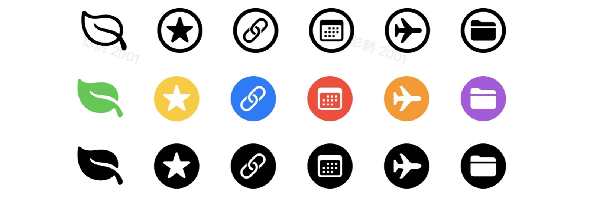

`SF Symbols` 有很多优点：

1. 它数量巨大，几乎覆盖所有应用场景；

2. 整合了 `San Francisco` 字体系统，当用户改变字体大小的时候，这些图标都会自动对齐；

3. 所有图标都支持颜色，我们可以根据需求搭配不同的颜色；

4. 使用这些图标时也无须安装，可以减少 App 的体积。

我们的 Moments App 也使用到 `SF Symbols` 来呈现点赞按钮。

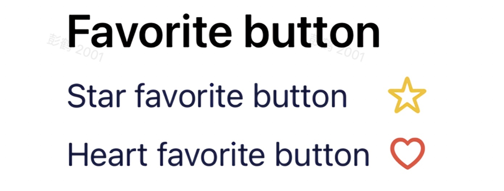

`SF Symbols` 里绝大部分的图标都通过了轮廓和填充两个版本，我们可以使用填充的图标表示选中状态。

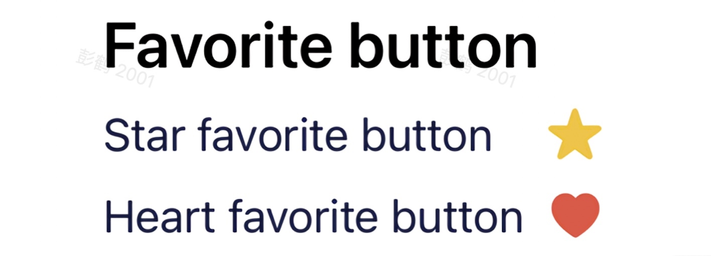

## 常用组件

随着 App 功能的增多，你会发现一些 UI 会出现在许多地方，例如下图的用户头像，分别出现在个人主页、朋友圈、点赞处。

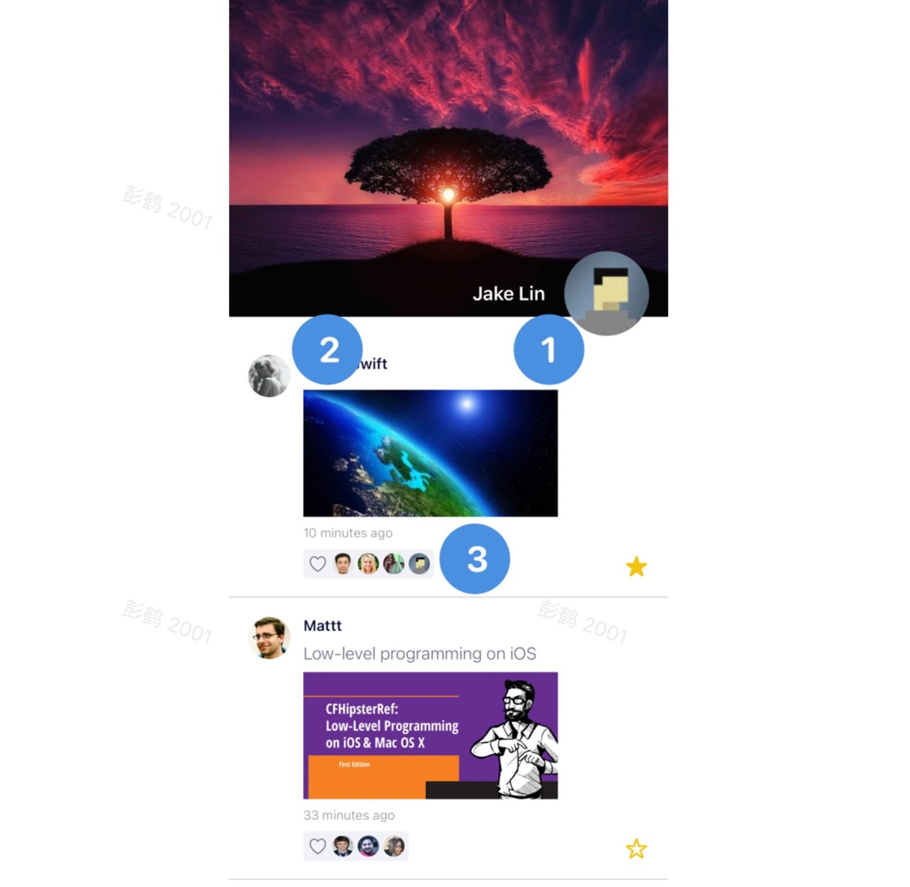

在这种情况下，我们就可以把这个重复出现的 UI 封装成一个常用的设计组件，并纳入我们在制定设计规范中。常用的组件一般有 *按钮（Button）*、*用户头像（User avatar）*、*复选框（Checkbox）*、*徽章（Badge）* 等等。下面是 Moments App 设计规定中用户头像组件的定义。

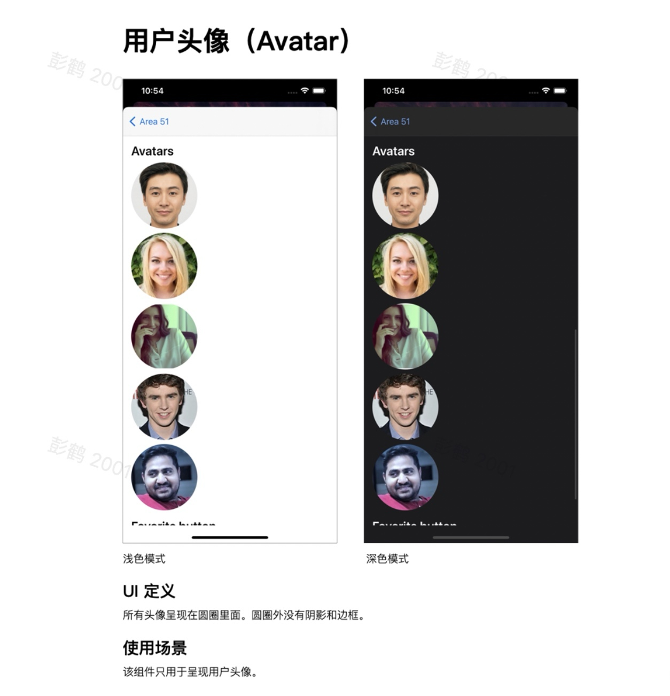

有了用户头像组件，设计师在设计过程中就不需要考虑在呈现头像时需要怎样设计，使用的圆角到底要多少度，是否需要阴影和边框等等。开发者也可以使用原先封装好的组件来加快开发。

需要注意的是，UI 组件是在开发过程中发现某个 UI 反复使用后才封装的，在开始的时候不要贪多，避免定义一堆不用的组件。

## 总结

在这一讲，我们通过 **间距，字体，颜色，图标和常用组件** 为例子来讲述一套统一的设计规范。有了它，能极大降低设计师与开发者的沟通成本，也节省设计师和开发者在设计或实现过程的时间，一举多得。

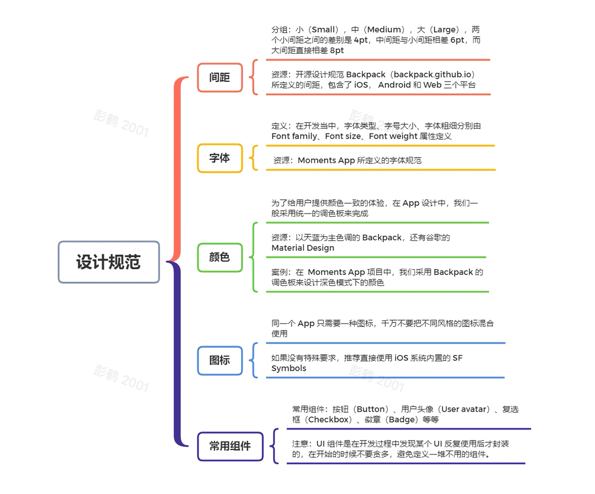

在定义和管理设计规范过程中需要注意这几点：

* 在定义规范过程中，设计师和开发者要一起参与进来，达成共识方便后期彼此间的沟通与协作；

* 在更新规范时，要有设计审查流程保证主设计版本一直在受控状态，我建议使用上节课所说的 GitHub Pull Request 流程来管理这套规范；

* 每次更新的时候，都需要更新设计文档，就像 Backpack 的文档一样，当设计师或者开发者有疑问的时候都可以把这个文档作为唯一信息源来查看；

* **坚持少即是多的原则**，特别是在定义规范开始的时候，不要求多求全，可以根据业务需要不断地迭代完善。

# 相关资料：

> [SF Symbols 官方下载链接](https://developer.apple.com/sf-symbols/)
