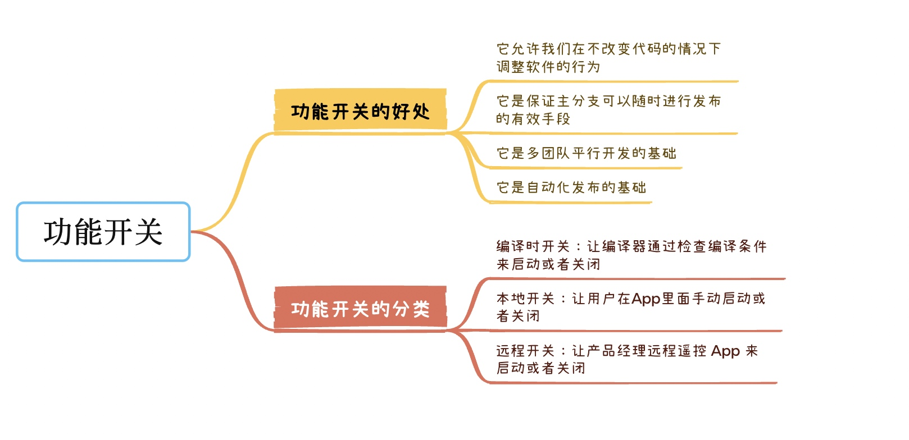
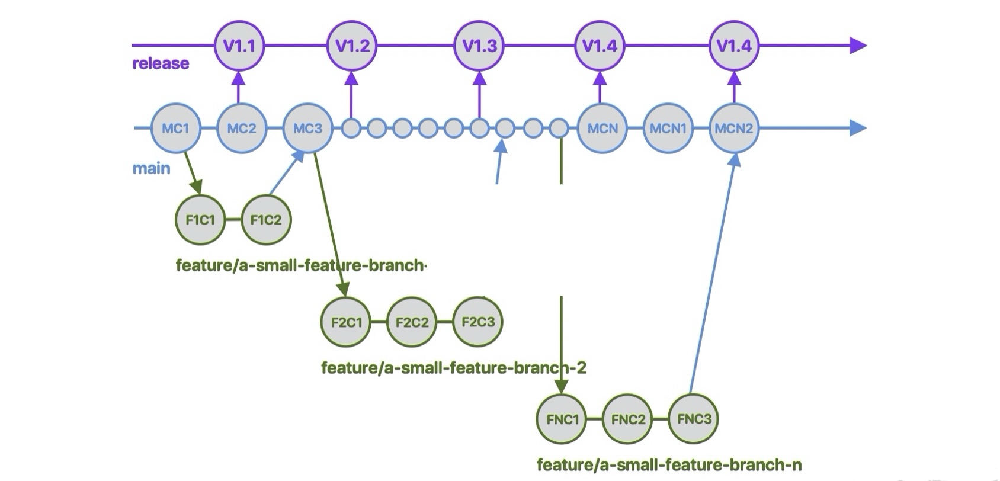
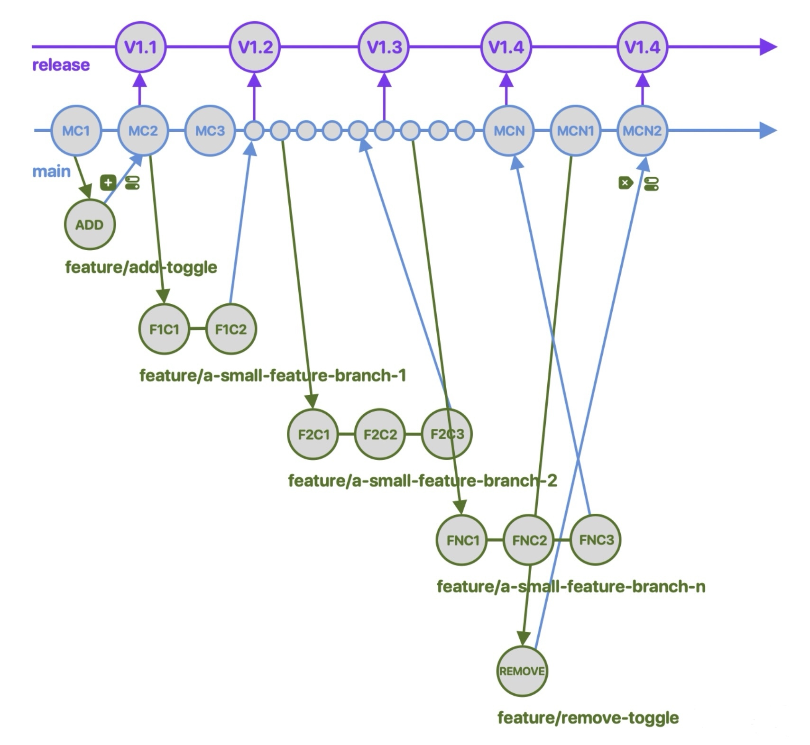
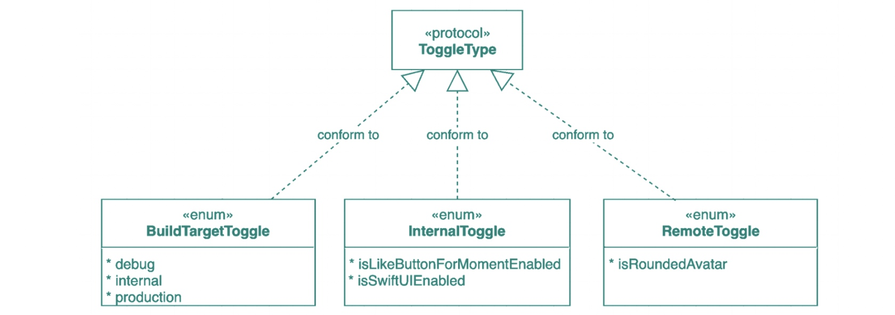
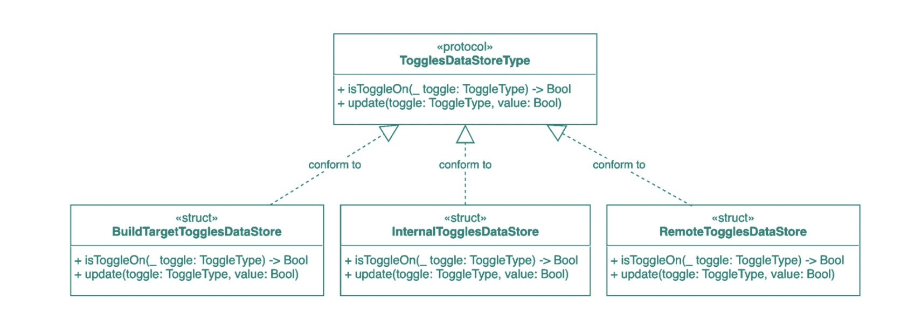
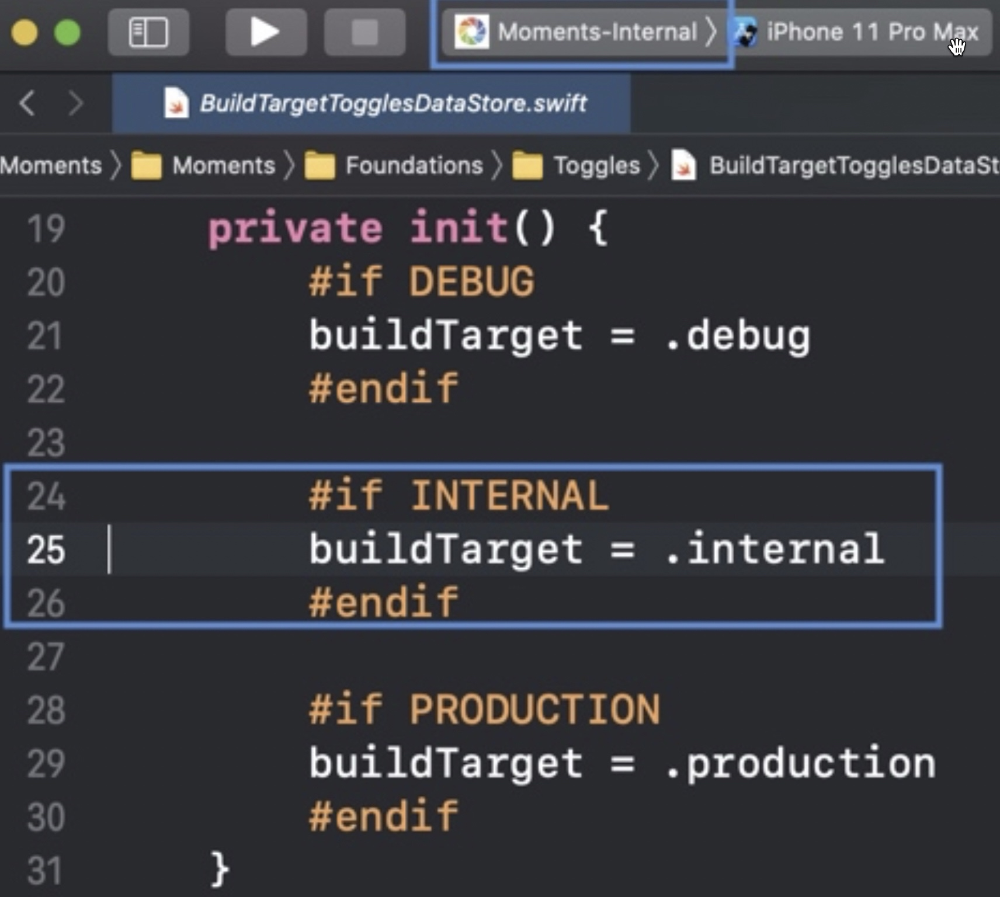

# 如何使用功能开关，支持产品快速迭代



<!-- more -->

代码管理规范一讲我提到过，开发功能的时候要新建功能分支。在实际工作当中，有一种功能分支我把它叫作 **长命功能分支（Long lived feature branch）**，因为有些大功能需要我们花几周甚至几个月来开发，相对应地它的功能分支也会非常庞大。

当整个功能开发完毕后，我们需要把它合并到主分支里面，因为里面代码实在太多了，不可避免地就会出现许多合并冲突。哪怕勉强修正并编译通过，App 里面也很可能隐藏一些不容易发现的 Bug。

怎样解决这种难题呢？

通常的办法是我们会把一个庞大的功能分拆成多个小任务，每个任务都建一个独立的功能分支，当一个任务完成后马上合并到主分支里面。



如上图所示，为了完成一个庞大的功能，如实时通讯功能，我们分拆成多个小的功能分支，比如显示对话的子功能分支 `branch-1`，显示表情符号的子功能分支 `branch-2` 等等。注意，我在图里面使用数字作为分支名字只是为了演示同一个大功能使用多个子分支，在现实情况下要根据每个小任务的内容进行命名。

但这样拆分成多个小的功能分支会导致什么问题呢？会出现我们每次把小任务合并到主分支的时候，不小心把未完成的功能发布给用户。例如我们在发布V1.2版本的 App 时就包含了 `branch-1` 分支上的代码，可是整个功能还没有开发完毕，我们并不愿意把这部分代码发布给 App Store 的用户。

那有没有什么办法既能及时合并代码，又能保证主分支可以随时发布呢？有，答案就是使用功能开关组件。

## 功能开关的好处

**功能开关** 是软件开发中一种十分实用且功能强大的技术，它允许我们在不改变代码的情况下调整软件的行为。有了它，我们在快速开发的同时，也能放心定期发布新版本。

具体来说，当我们开发每一个大功能时，如果先定义一个功能开关，然后在整个功能开发完毕后再移除它，那么在移除之前，我们提交的任何版本就能避免因为疏忽大意而把未完成的功能发布到终端用户手上。



如上图所示，当我们开发一个大功能时，先从主分支签出一个功能分支 `add-toggle` 来添加一个功能开关。 然后我们就可以把该功能拆分成多个子功能分支来进行开发，并不断地合并到主分支里面。在整个功能开发完毕以后，我们可以从主分支签出一个分支 `remove-toggle` 来把功能开关删除掉。这个功能只会在 V1.4 版本里面才会发布给终端用户。在此之前用户完全不知道这个功能的存在。

使用功能开关是保证主分支可以随时进行发布的有效手段。可以说，**一个能随时发布的主分支是衡量一个开发环境成熟与否的标准**，为什么这样说呢？有两大原因：

1. 它是多团队平行开发的基础，当其中一个团队完成了一个功能以后，就可以在不与任何其他团队沟通的情况下马上进行发布；

2. 它是自动化发布的基础，有了随时可以发布的主分支，我们只需要更新版本号就可以让 CI 在任何时候打包并发布到 App Store，无须任何人为参与。

既然功能开关那么强大，那怎么实现呢？接下来我们就结合 Moments App 一起来看看。

## 功能开关组件的实现

根据不同的使用场景，我们为Moments App 开发了三类功能开关组件：**编译时开关、本地开关和远程开关**。

* 编译时开关：让编译器通过检查编译条件来启动或者关闭一些功能。

* 本地开关：让用户在 App 里面手动启动或者关闭一些功能。

* 远程开关：让产品经理远程遥控 App 来启动或者关闭一些功能。

下面我们一起来看看怎样实现这些功能开关组件吧。首先我们定义了一个名字叫作 `ToggleType` 的协议 `（Protocol）`，然后分别定义了三个枚举类型 `（Enum）`来代表三类开关。



有了这些功能开关的定义以后，接着我们定义这些开关的 `DataStore`。首先建立了一个名叫 `TogglesDataStoreType` 的协议，它只定义了两个方法，其中 `isToggleOn(_ toggle: ToggleType) -> Bool` 用于读取某个开关的值，而 `update(toggle: ToggleType, value: Bool)` 用于更新某个开关的值。



然后我们为每一类开关定义一个实现的结构体`（Struct）`。因为远程开关我会在后面的 29 讲详细介绍，所以在这一讲我主要为你介绍下编译时开关和本地开发怎样实现的。

## 编译时开关组件

下面是编译时开关 `BuildTargetTogglesDataStore`的实现代码。

``` swift
struct BuildTargetTogglesDataStore: TogglesDataStoreType {
    static let shared: BuildTargetTogglesDataStore = .init()
    private let buildTarget: BuildTargetToggle
    private init() {
        #if DEBUG
        buildTarget = .debug
        #endif
        #if INTERNAL
        buildTarget = .internal
        #endif
        #if PRODUCTION
        buildTarget = .production
        #endif
    }
    func isToggleOn(_ toggle: ToggleType) -> Bool {
        guard let toggle = toggle as? BuildTargetToggle else {
            return false
        }
        return toggle == buildTarget
    }
    func update(toggle: ToggleType, value: Bool) { }
}
```

因为 `BuildTargetTogglesDataStore` 遵循了 `TogglesDataStoreType`，我在这里实现了 `isToggleOn` 和 `update` 两个方法。由于我们不可能在运行时更新编译时的编译条件，因此 `update` 方法的实现体为空。

而在 `isToggleOn` 方法里面，我们会检查传递进来的 `ToggleType` 的值是否和属性 `buildTarget` 的值相等，如果相等就返回 `true`，如果不相等就返回 `false`。

那 `buildTarget` 的值是怎样来的呢？我们可以看看 `init` 方法。



在 `init` 方法里面，我们有三条判断编译条件的语句，当编译条件包含了 `INTERNAL` 时，就会把 `buildTarget` 赋值为 `.internal` 。那 `INTERNAL` 从哪里来的呢？

我在如何搭建多环境支持那一讲提到过怎样通过 `xcconfig` 文件来配置多个 `Build Configuration`。该编译条件 `INTERNAL` 来自 `InternalProject.xcconfig` 文件。如下所示，我们把 `INTERNAL` 赋值给 `SWIFT_ACTIVE_COMPILATION_CONDITIONS` 。

``` swift
SWIFT_ACTIVE_COMPILATION_CONDITIONS = $(inherited) INTERNAL
```

在编译的时候，编译器会从 `SWIFT_ACTIVE_COMPILATION_CONDITIONS`读取编译条件的值，当发现该编译条件已经定义了，就会编译 `#if #endif` 代码块内的代码。

回到上图 init 方法的例子，当我们选择了 `Moments-Internal Scheme ` 时，编译器就会选择名字叫作 `Internal` 的 `Build Configuration`。这个 `Configuration` 读取 `InternalProject.xcconfig` 后把`SWIFT_ACTIVE_COMPILATION_CONDITIONS` 赋值为 `INTERNAL`。因此，在编译的时候，上面的代码只有第 25 行会编译，第 21 行和第 29 行都会被忽略掉。

通过编译时开关，我们就能让不同环境版本的 App 激活或者隐藏不同的功能。下面是如何导航到隐藏功能菜单页面的代码。它的大致逻辑是，我们通过重写 `UIWindow` 的 `motionEnded` 方法来捕捉手机震动的事件。

``` swift
extension UIWindow {
    override open func motionEnded(_ motion: UIEvent.EventSubtype, with event: UIEvent?) {
        if BuildTargetTogglesDataStore.shared.isToggleOn(BuildTargetToggle.debug)
            || BuildTargetTogglesDataStore.shared.isToggleOn(BuildTargetToggle.internal) {
            let router: AppRouting = AppRouter()
            if motion == .motionShake {
                router.route(to: URL(string: "\(UniversalLinks.baseURL)InternalMenu"), from: rootViewController, using: .present)
            }
        }
    }
}
```

具体来说，当用户在摇动手机的时候，代码会通过`BuildTargetTogglesDataStore` 的 `isToggleOn` 方法来检查当前的 App 是否为开发环境或者测试环境版本，如果“是”就会使用 `AppRouter` 到导航到隐藏功能菜单页面。如果“不是”（如生产环境 App Store版本），就不进行导航。这样能保证从 App Store 上下载 App 的用户，没办法使用隐藏菜单的功能。

## 本地开关组件

如果说编译时开关能够方便你为不同环境的 App 激活或者隐藏不同的功能，那么本地开关则可以让内部测试人员和产品经理随时测试和验证功能，从而保证产品快速的迭代。

下面一起看看本地开关的实现代码。

``` swift
enum InternalToggle: String, ToggleType {
    case isLikeButtonForMomentEnabled
    case isSwiftUIEnabled
}
struct InternalTogglesDataStore: TogglesDataStoreType {
    private let userDefaults: UserDefaults
    private init(userDefaults: UserDefaults) {
        self.userDefaults = userDefaults
        self.userDefaults.register(defaults: [
            InternalToggle.isLikeButtonForMomentEnabled.rawValue: false,
            InternalToggle.isSwiftUIEnabled.rawValue: false
            ])
    }
    static let shared: InternalTogglesDataStore = .init(userDefaults: .standard)
    func isToggleOn(_ toggle: ToggleType) -> Bool {
        guard let toggle = toggle as? InternalToggle else {
            return false
        }
        return userDefaults.bool(forKey: toggle.rawValue)
    }
    func update(toggle: ToggleType, value: Bool) {
        guard let toggle = toggle as? InternalToggle else {
            return
        }
        userDefaults.set(value, forKey: toggle.rawValue)
    }
}
```

当每次新增一个本地开关的时候，我们都在 `InternalToggle` 枚举里面添加一个 `case`。当前的 Moments App 有两个本地开关，分别用于 **点赞功能** 和 **使用 SwiftUI**。

因为 `InternalTogglesDataStore` 也遵循了`TogglesDataStoreType` 协议，所以也需要实现 `isToggleOn` 和`update` 两个方法。它们都使用了 `UserDefaults` 来读写配置信息，这样能保证用户重启 App 以后也能获取之前所选择的开关配置。

这里我给你分享一个管理本地开关的技巧。

在 `init` 方法里面，我通过 `UserDefaults` 的 `register` 方法为每个开关赋予默认值。绝大多数情况下，这个默认值都为 `false`，表示该功能还没有发布。

那什么时候这个值会成为 `true` 呢？假如我们完成了一个功能，而且产品经理验证过可以发布上线，那么我就可以把该开关的默认值设为 `true`。但上线以后发现该功能引起严重的崩溃，我们可以马上把该值修改为 `false` 并立刻发布新版本。

还有一点需要注意的是，当功能上线并运行正常的情况下，要及时清理相关的功能开关，因为开关太多会增加代码逻辑的复杂度。

下面一起看看代码中使用本地开关的例子吧。

``` swift
if InternalTogglesDataStore.shared.isToggleOn(InternalToggle.isSwiftUIEnabled) {
    window?.rootViewController = UIHostingController(rootView: SwiftUIMomentsListView().environmentObject(UserDataStoreObservableObject()))
} else {
    window?.rootViewController = MomentsListViewController()
}
```

我们通过 `InternalTogglesDataStore` 来检查 `.isSwiftUIEnabled` 开关是否启动，如果“是”就启动 `SwiftUI` 的界面，否则就启动 `UIKit` 的界面。下面是演示的效果。


我们可以在内部隐藏菜单里面启动或者关闭 `SwiftUIEnable` 开关。App 在启动的时候会根据该开关来选择启动 `SwiftUI` 或者 `UIKit` 的界面。

# 总结

这一讲主要介绍了如何使用功能开关来解决长命功能分支的问题，并详细介绍了如何开发编译时开关组件和本地开发组件。有了这些功能开关组件以后，既保证我们能快速开发功能，又能保证发布的版本不会出错，让整个团队在安全的环境下快速迭代。

