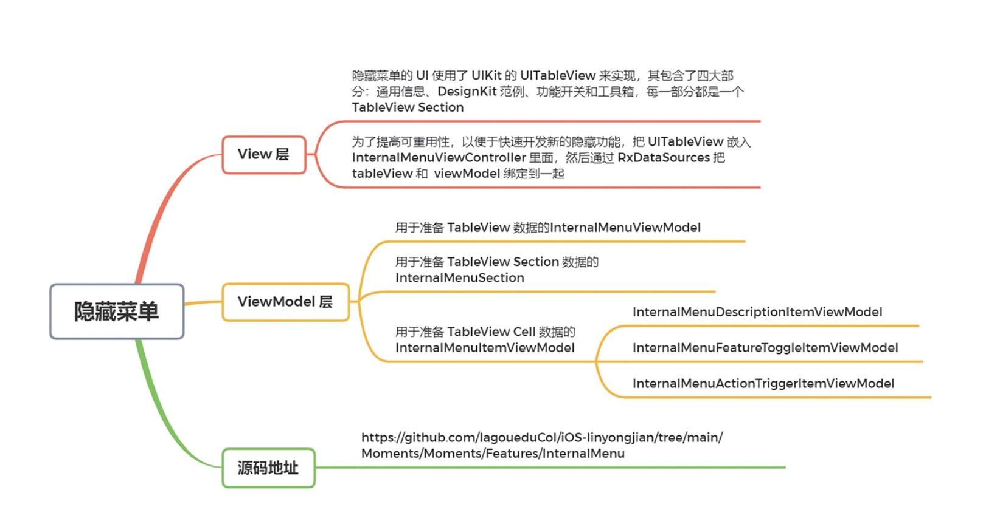

# 如何实现隐藏菜单，快速测试与验证？

<!-- more -->

不知道在工作当中，你有没有为了测试和验证开发中的功能，特意为测试和产品经理打包一个特殊版本的 App？或者当多个团队并行开发的时候，为了测试，每个团队都单独打包出不同版本的 App？还有当你想添加某些供内部使用的功能（如清理 Cache），但又不想让 App Store 的用户使用，你是不是又专门打包了一个特殊版本的 App？

每次遇到这些情况，你是不是觉得特麻烦？

其实，这些都可以通过一个内部隐藏功能菜单来解决。在这一讲我就结合我们的 Moments App 来和你介绍下，如何开发了一个隐藏功能菜单，快速实现功能测试和验证。

