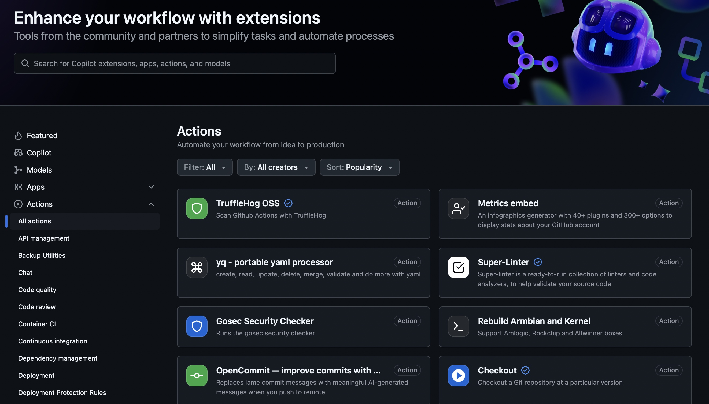
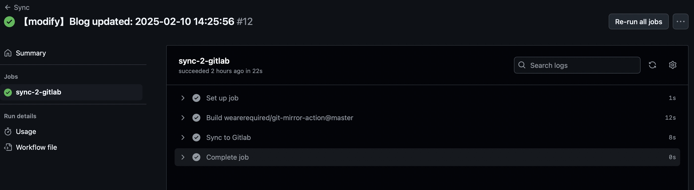

# 一、GitHub Actions 是什么？


<!-- more -->

**GitHub Actions** 是一个持续集成和持续交付 `(CI/CD)` 平台，允许您自动化构建、测试和部署流水线。您可以创建工作流来构建和测试存储库中的每个请求，或者将合并的请求部署到生产环境中。

大家知道，持续集成由很多操作组成，比如抓取代码、运行测试、登录远程服务器，发布到第三方服务等等。GitHub 把这些操作就称为 `actions`。

很多操作在不同项目里面是类似的，完全可以共享。GitHub 注意到了这一点，想出了一个很妙的点子，允许开发者把每个操作写成独立的脚本文件，存放到代码仓库，使得其他开发者可以引用。

如果你需要某个 `action`，不必自己写复杂的脚本，直接引用他人写好的 `action` 即可，整个持续集成过程，就变成了一个 `actions` 的组合。这就是 `GitHub Actions` 最特别的地方。

GitHub 做了一个 [官方市场](https://github.com/marketplace?type=actions)，可以搜索到他人提交的 `actions`。另外，还有一个 [awesome actions](https://github.com/sdras/awesome-actions) 的仓库，也可以找到不少 `action`。



# 二、基本概念

GitHub Actions 有一些自己的术语。

1. **workflow** （工作流程）：持续集成一次运行的过程，就是一个 `workflow`。

工作流是一个可配置的自动化流程，它将运行一个或多个作业。工作流是由签入存储库的 `YAML` 文件定义的，并且在由 `repository` 中的事件触发时运行，或者可以手动触发，或者按照定义的时间表运行。

工作流在 `.github/workflows` 目录中定义，并且存储库可以有多个工作流，每个工作流可以执行不同的任务集。例如，您可以使用一个工作流来构建和测试拉请求，使用另一个工作流在每次创建发行版时部署您的应用程序，还可以使用另一个工作流在每次有人打开新问题时添加标签。

2. **job** （作业）：一个 `workflow` 由一个或多个 `jobs` 构成，含义是一次持续集成的运行，可以完成多个任务。

作业是工作流中在同一运行程序上执行的一组步骤。每个步骤要么是将要执行的 `shell` 脚本，要么是将要运行的操作。

3. **step**（步骤）：每个 `job` 由多个 `step` 构成，一步步完成。

步骤按顺序执行，并相互依赖。由于每个步骤都在同一个运行程序上执行，因此可以将数据从一个步骤共享到另一个步骤。例如，您可以有一个生成应用程序的步骤，然后有一个测试生成的应用程序的步骤。
 
4. **action** （动作）：每个 `step` 可以依次执行一个或多个命令（action）。

动作是 GitHub Actions 平台的自定义应用程序，它执行复杂但经常重复的任务。使用一个操作来帮助减少在工作流文件中编写的重复代码的数量。操作可以从 GitHub 获取 git 存储库获取。

5. **Runners** （运行器）：运行器是在工作流被触发时运行它们的服务器。每个运行器可以一次运行一个作业。

# 三、workflow 文件

GitHub Actions 的配置文件叫做 workflow 文件，存放在代码仓库的 `.github/workflows` 目录。

目录结构如下：

``` swift
.github
└── workflows
    ├── foo.yml
    └── sync-2-gitlab.yml
```

workflow 文件采用 `YAML` 格式，文件名可以任意取，但是后缀名统一为 `.yml`，比如 `foo.yml`。一个库可以有多个 workflow 文件。GitHub 只要发现 `.github/workflows` 目录里面有 `.yml` 文件，就会自动运行该文件。

workflow 文件的配置字段非常多，详见官方文档。下面是一些基本字段。

1. **name**
 
`name` 字段是 workflow 的名称。如果省略该字段，默认为当前 workflow 的文件名。

``` swift
name: GitHub Actions Demo
```

2. **on**

`on` 字段指定触发 workflow 的条件，通常是某些事件。

``` swift
on: push
```

上面代码指定，`push` 事件触发 workflow。

`on` 字段也可以是事件的数组。

``` swift
on: [push, pull_request]
```

上面代码指定，`push` 事件或 `pull_request` 事件都可以触发 workflow。

完整的事件列表，请查看 [官方文档](https://docs.github.com/en/actions/writing-workflows/choosing-when-your-workflow-runs/events-that-trigger-workflows)。除了代码库事件，GitHub Actions 也支持外部事件触发，或者定时运行。

3. **on.<push|pull_request>.<tags|branches>**

指定触发事件时，可以限定分支或标签。

``` swift
on:
  push:
    branches:    
      - master
```

上面代码指定，只有 `master` 分支发生 `push` 事件时，才会触发 workflow。

4. **jobs.<job_id>.name**

workflow 文件的主体是 `jobs` 字段，表示要执行的一项或多项任务。

`jobs`字段里面，需要写出每一项任务的 `job_id` ，具体名称自定义。`job_id` 里面的 `name` 字段是任务的说明。

``` swift
jobs:
  my_first_job:
    name: My first job
  my_second_job:
    name: My second job
```

上面代码的 `jobs` 字段包含两项任务，`job_id` 分别是 `my_first_job` 和 `my_second_job`。

5. **jobs.<job_id>.needs**

`needs` 字段指定当前任务的依赖关系，即运行顺序。

``` swift
jobs:
  job1:
  job2:
    needs: job1
  job3:
    needs: [job1, job2]
```

上面代码中，`job1` 必须先于 `job2` 完成，而 `job3` 等待 `job1` 和 `job2` 的完成才能运行。因此，这个 workflow 的运行顺序依次为：`job1`、`job2`、`job3`。

6. **jobs.<job_id>.runs-on**

`runs-on` 字段指定运行所需要的虚拟机环境。它是必填字段。目前可用的虚拟机如下。

```
ubuntu-latest，ubuntu-18.04或ubuntu-16.04
windows-latest，windows-2019或windows-2016
macOS-latest或macOS-10.14
```

下面代码指定虚拟机环境为 `ubuntu-18.04`。

``` swift
runs-on: ubuntu-18.04
```

7. **jobs.<job_id>.steps**

`steps` 字段指定每个 Job 的运行步骤，可以包含一个或多个步骤。每个步骤都可以指定以下三个字段。

```
jobs.<job_id>.steps.name：步骤名称。
jobs.<job_id>.steps.run：该步骤运行的命令或者 action。
jobs.<job_id>.steps.env：该步骤所需的环境变量。
```

下面是一个完整的 workflow 文件的范例。

``` swift
name: Greeting from Mona
on: push

jobs:
  my-job:
    name: My Job
    runs-on: ubuntu-latest
    steps:
    - name: Print a greeting
      env:
        MY_VAR: Hi there! My name is
        FIRST_NAME: Mona
        MIDDLE_NAME: The
        LAST_NAME: Octocat
      run: |
        echo $MY_VAR $FIRST_NAME $MIDDLE_NAME $LAST_NAME.
```

上面代码中，`steps` 字段只包括一个步骤。该步骤先注入四个环境变量，然后执行一条 Bash 命令。

# 四、实例：个人项目通过 GitHub Actions 同步到 GitLab

1. 在 Github 项目
`Settings->Secrets->Actions`，名称为：`GITLAB`，值为：`~/.ssh/`目录下`id_rsa` 文件内容，⚠️注意不是 `id_rsa.pub`：


2. GitHub 创建 Github workflow

在个人项目根目录下找到 `.github/workflows` 文件夹，如果没有就创建一个，新建一个 `sync-2-gitlab.yml` 文件，填入下面的内容：

``` swift
name: Sync

on:
  push:
    branches: [main, hexo]

jobs:
  sync-2-gitlab:
    runs-on: ubuntu-latest
    steps:
      - name: Sync to Gitlab
        uses: wearerequired/git-mirror-action@master
        env:
          # 注意在 Github Settings->Secrets 配置的 GITLAB
          SSH_PRIVATE_KEY: ${{ secrets.GITLAB }}
        with:
          # 注意替换为你的 GitHub 源仓库地址
          source-repo: git@github.com:fengyanxin/fengyanxin.github.io.git
          # 注意替换为你的 Gitlab 目标仓库地址
          destination-repo: git@gitlab.com:fengyanxin/fengyanxin.git
```

3. 推送个人项目到 GitHub

把文件推送到 github 中，这时应该可以在 github action 看见刚刚的 workflow 在运行了。



以后，项目每次修改后推送源码，GitHub Actions 都会自动运行，将构建产物发布到网页。

# 五、常见用例

这里分享几个 GitHub Actions 的常见用例：

1. 自动化构建和测试

**用例描述**：每当代码被推送到仓库或发起 Pull Request 时，自动构建和运行测试。

``` Yaml
name: CI
 
on: [push, pull_request]
 
jobs:
  build:
    runs-on: ubuntu-latest
 
    steps:
    - uses: actions/checkout@v2
    - name: Set up Node.js
      uses: actions/setup-node@v2
      with:
        node-version: '14'
    - name: Install dependencies
      run: npm install
    - name: Run tests
      run: npm test
```

2. 发布到 npm

**用例描述**：当代码合并到主分支时，自动将新版本发布到 npm。

``` Yaml
name: Publish to npm
 
on:
  push:
    branches: [ main ]
 
jobs:
  publish-npm:
    runs-on: ubuntu-latest
    steps:
      - uses: actions/checkout@v2
      - uses: actions/setup-node@v2
        with:
          node-version: '14'
          registry-url: 'https://registry.npmjs.org'
      - run: npm install
      - run: npm publish --access public
        env:
          NODE_AUTH_TOKEN: ${{ secrets.NPM_TOKEN }}
```

3. 部署到 Heroku

**用例描述**：将应用部署到 Heroku。

``` Yaml
name: Deploy to Heroku
 
on: [push]
 
jobs:
  build:
    runs-on: ubuntu-latest
    steps:
    - uses: actions/checkout@v2
    - uses: akhileshns/heroku-deploy@v3.12.12 # 使用特定版本的 action
      with:
        heroku_api_key: ${{ secrets.HEROKU_API_KEY }}
        heroku_app_name: "your-app-name" # 需要替换为你的 Heroku 应用名
        heroku_email: "your-email@example.com" # 需要替换为你的 Heroku 邮箱地址
```

4. 自动化 Docker 镜像构建和推送

**用例描述**：每当代码被推送到仓库时，自动构建 Docker 镜像并推送到 Docker Hub。

``` Yaml
name: Docker Image CI
 
on: [push]
 
jobs:
  build:
    runs-on: ubuntu-latest
    steps:
    - uses: actions/checkout@v2
    - name: Build the Docker image
      run: docker build . --file Dockerfile --tag my-image-name:$(date +%s)
    - name: Log into registry
      run: echo "${{ secrets.DOCKER_PASSWORD }}" | docker login -u "${{ secrets.DOCKER_USERNAME }}" --password-stdin
    - name: Push the Docker image
      run: docker push my-image-name:$(date +%s)
```

# 六、参考资料

1. [GitHub Pages 官方文档](https://docs.github.com/cn/actions)
2. [阮一峰的博客](https://www.ruanyifeng.com/blog/2019/09/getting-started-with-github-actions.html)
