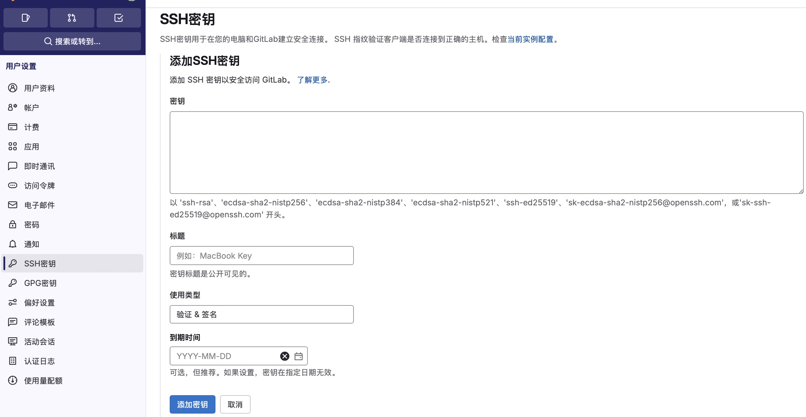

## 前言

> 因为自己的博客，有时候访问还是比较慢的，原因是我的代码是在 GitHub 上托管的，众所周知，GitHub 是国外的服务器，在国内访问就是特别慢，然后，我就想是否可以找到国内的既能实现代码托管，又能生成静态网页的平台，来实现 Hexo 双线部署。
>
> 于是，我找到了 Coding pages，但是它被腾讯从 Coding 下线了，放到了腾讯云上，开始收费了；然后，我又找到了 Gitee pages，但是它被阿里从 Gitee 下线了，放到了阿里云上，也开始收费了；那该怎么办呢？只能说功夫不负有心人，最后我找到了 Gitlab pages！
>

<!-- more -->

## 如何使用 Gitlab pages?

### Gitlab 创建项目

首先打开 Gitlab 登录：[GitLab](https://gitlab.com/users/sign_in) ，这里我没有注册直接使用的是 Github 账号登录。

然后就是先创建一个 Gitlab 的项目了，这里与 github、gitee 都是大同小异，就不多说了。

### 生成 git 公钥（如果之前有配置，直接跳过）

#### 1、配置本地用户名及邮箱

``` swift
# 配置用户名
git config --global user.name "用户名"
# 配置邮箱
git config --global user.email "邮箱地址"
```

以上命令执行结束后，可用 `git config --global --list` 命令查看配置是否成功

#### 2、git生成公钥

在 终端 窗口输入下面指令即可生成带注释的公钥：

``` swift
ssh-keygen -t rsa -C '邮箱地址'
```

* 设置存放公钥的位置，默认的话直接回车键确认

* 输入密码和确认密码，不设置密码直接按回车键

### 查看本地 git 公钥

通过 终端 命令窗口：
查看公钥：`cat id_rsa.pub` 或者 `vim id_rsa.pub`

因为在之前我的电脑上是配置过的，所以直接输入 `cat ~/.ssh/id_rsa.pub` 即可查看，然后进行配置：


### 开启 GitLab Pages

想要开启 GitLab Pages，首先需要将 Github 上的博客文件同步到 Gitlab 项目，然后通过 `gitLab ci` 触发自动部署，来开启 GitLab Pages。

#### 1、使用 Github actions 把 github 仓库代码同步到 gitlab 仓库

* gitlab 添加个人令牌（token）

在设置中找到 访问令牌、然后添加


* 在 Gitlab
`设置->安全设置->SSH公钥`，标题可以随便起名，值为：上面生成SSH的公钥：



* 在 Github 项目
`Settings->Secrets->Actions`，名称为：`GITLAB`，值为：上面生成的个人令牌


* GitHub 创建 Github workflow

在项目根目录下找到 `.github/workflows` 文件夹，如果没有就创建一个，新建一个 `sync-2-gitlab.yml`文件，填入下面的内容：

``` swift
name: Sync

on:
  push:
    branches: [main, hexo]

jobs:
  sync-2-gitlab:
    runs-on: ubuntu-latest
    steps:
      - name: Sync to Gitlab
        uses: wearerequired/git-mirror-action@master
        env:
          # 注意在 Github Settings->Secrets 配置的 GITLAB
          SSH_PRIVATE_KEY: ${{ secrets.GITLAB }}
        with:
          # 注意替换为你的 GitHub 源仓库地址
          source-repo: git@github.com:fengyanxin/fengyanxin.github.io.git
          # 注意替换为你的 Gitlab 目标仓库地址
          destination-repo: git@gitlab.com:fengyanxin/fengyanxin.git
```

保存，并把文件推送到 github 中，这时应该可以在 github action 看见刚刚的 workflow 在运行了。

注意：如果同步到 Gitlab 的 action 运行报错时可以在项目中的 `Settings->Repository->Protected branches`右边的 `Expand`,把`Allowed to force push`按钮打开，或者点`Unprotect` :


#### 2、配置 Gitlab 的 ci 文件 .gitlab-ci.yml 文件

由于我的这个仓库源码是从 github 项目打包后产出 public 的纯 html 静态资源后，在通过 ci 脚本文件提交到 gitlab 仓库的，所以我这里的脚本内容就可以直接使用纯 html 的脚本

根目录添加 `.gitlab-ci.yml` 文件（根据自己的实际需求配置对应脚本内容）：

``` swift
pages:
  stage: deploy
  script:
    - mkdir .public
    - cp -r ./* .public
    - rm -rf public
    - mv .public public
  artifacts:
    paths:
      - public
  rules:
    - if: $CI_COMMIT_BRANCH == $CI_DEFAULT_BRANCH
```

或者在 Gitlab 项目下添加 CI，文件内容如上，添加完成后会在项目目录下生成一个 `.gitlab-ci.yml`：


#### 3、配置 Gitlab 的 pages

* 上面的 Github 代码同步 和 Gitlab CI 执行完成之后，会在项目中生成一个 Gitlab pages， 如下图：


* 点开 `部署 - Pages`可以查看：


* 此时，输入 Pages 的域名就可以查看自己的博客了：


至此，Gitlab pages 的部署就完成了！

但是，当我还沉浸在成功的喜悦中的时候，就又 Get 到了一个非常坏的消息。

## Gitlab 将不再为中国用户服务


近日，GitLab 发布了一则重要通知 **《Important Change to Your GitLab.com Account》**，宣布将不再为位于 **中国大陆、澳门和香港** 的用户提供 `GitLab.com` 账户服务。该平台建议受影响的用户将账户迁移至 `极狐 GitLab（JiHu）`，这是由 GitLab 授权的独立公司，专门为这些地区提供本地化服务。


用户必须在 **2025 年 2 月 18 日** 之前完成迁移，之后 GitLab 将从系统中删除帐户。

所以，以后 `GitLab.com` 就不能用了，只能使用 `极狐 GitLab（JiHu）`，遗憾的是 `极狐 GitLab（JiHu）` 也不再提供 Pages功能了！


这一顿操作真的是...!!!

博主只能掩面叹息！


