# 【Hexo】Mac 上使用Hexo + Github搭建个人博客

## 为什么要用Hexo + Github？

### Hexo介绍

Hexo是一款基于Nodejs的，快速、简洁且高效的博客框架。它具有丰富的插件和主题，具有超快的速度，支持Makedown语法，可以方便快捷的编写博客文档。同时还支持node命令，可以一键部署到GitHub Pages, Heroku 或其他平台。更详细的信息可以看一下 [Hexo官网](https://hexo.io/zh-cn) 。

值得一提的是，它在github上的*star*现在已经达到了[36.3k](https://github.com/hexojs/hexo)，优不优秀可见一斑。

<!-- more -->

Hexo主要有以下特点：

1. 超快速度：*Node.js*所带来的超快生成速度，可以让上百个页面在几秒内完成渲染。

2. 支持 *Markdown*：Hexo 支持 GitHub Flavored Markdown 的所有功能，甚至可以整合 Octopress 的大多数插件。

3. 一键部署：只需一条指令即可部署到 *GitHub Pages, Heroku* 或其他平台。

4. 插件或可扩展性：强大的 API 带来无限的可能，与数种模板引擎（*EJS，Pug，Nunjucks*）和工具（*Babel，PostCSS，Less/Sass*）轻易集成。

### Guthub

GitHub 那就更不用说了，做程序员的都知道，它是多nice的一个东西。

今天我们要说的主要是它提供的一个功能：*GitHub Pages* ，GitHub Pages 允许每个账户创建一个名为 {username}.http://github.io 的仓库，另外它还会自动为这个仓库分配一个 http://github.io 的二级域名，这就为我们搭建个人博客提供了很大的方便，既为我们解决了域名、服务器的问题，又为我们提供了一个稳定且免费的静态站点。

## 安装环境

### 安装Node.js

1. 官网下载
下载地址：https://nodejs.org/en/

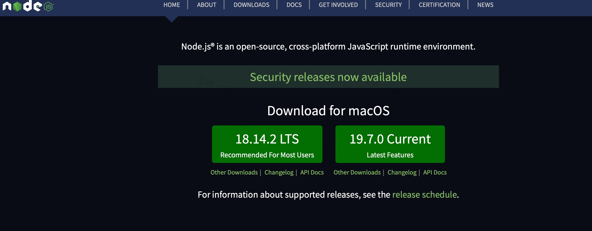

2. 使用homebrew安装

```jsx
## 搜索现有node版本
brew search node
## 安装指定版本
brew install node@x
```
安装完成之后，可以用 *npm -v* 查询验证，如果不指定版本安装为最新版本

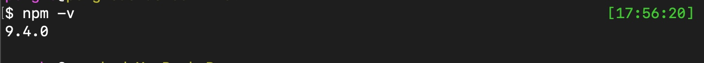

### 安装Hexo

1. 使用外网下载（相对比较慢）

```jsx
// 使用命令去安装Hexo
npm install -g hexo-cli 
```

2. 更换国内镜像后下载

```jsx
// 使用命令安装淘宝镜像：
npm install -g cnpm --registry=https://registry.npm.taobao.org
```
```jsx
// 使用淘宝源安装Hexo
cnpm install -g hexo-cli 
```
安装成功后，可以使用 *hexo -v* 命令查看一下hexo版本：

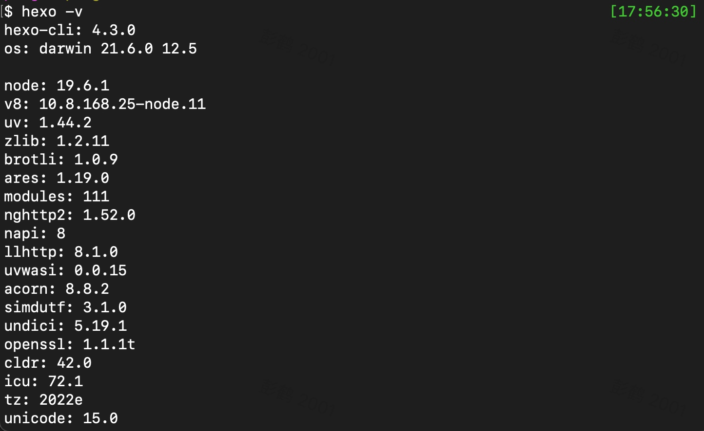

## 初始化Hexo Blog

### 新建一个文件夹

我这里创建一个名为Blogs的文件夹，并进入该文件夹内：

### 初始化Hexo

```jsx
// 初始化hexo
hexo init
```
初始化成功如下：

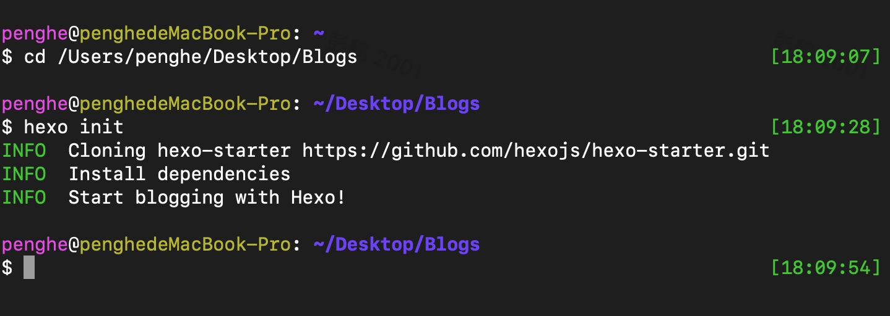

这时候Blogs下的目录结构如下：

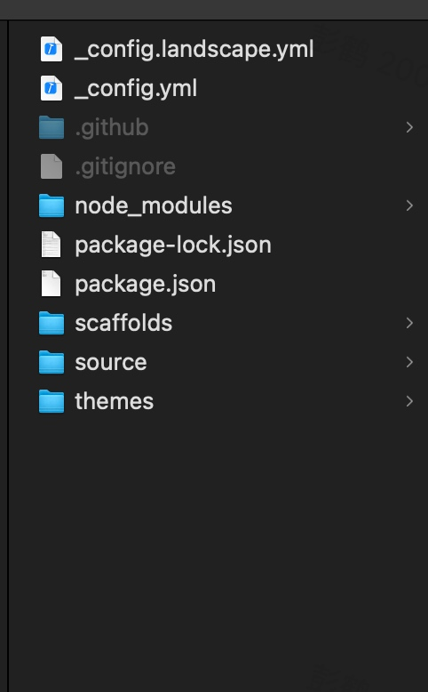

### 本地启动Hexo

```jsx
// 启动Hexo
hexo s
```

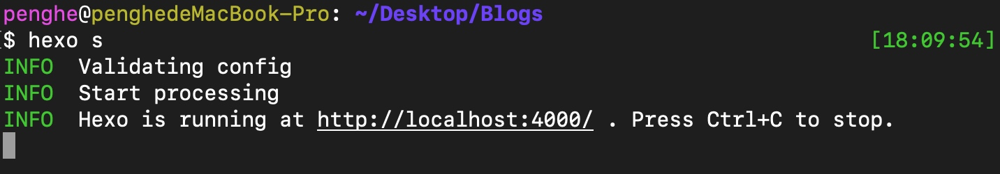

### 浏览器打开博客网站

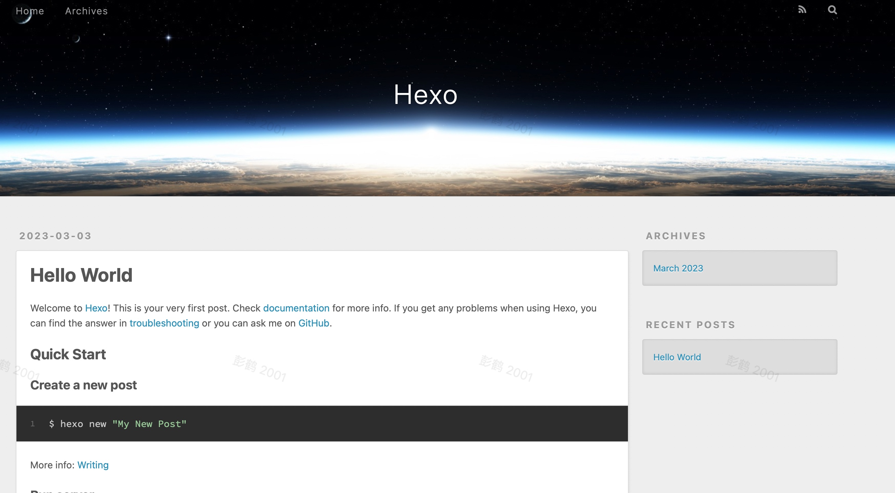

## 创建博客文章

### 创建博客

```jsx
// 创建一篇博客
hexo n "first blog"
```

文章在Blogs目录下的结构如下：

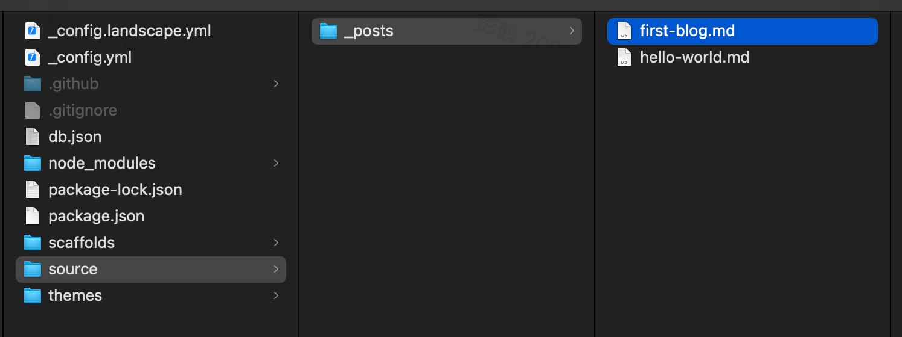

### 清理项目缓存

新增博客文章或者修改博客文章内容，需要执行此命令:

```jsx
// 清理之前生成的网站
hexo clean
```

### 重新生成博客

```jsx
// 重新生成博客
hexo g
```

### 再次启动项目

```jsx
// 再次启动博客网站
hexo s
```
浏览器页面展示如下：

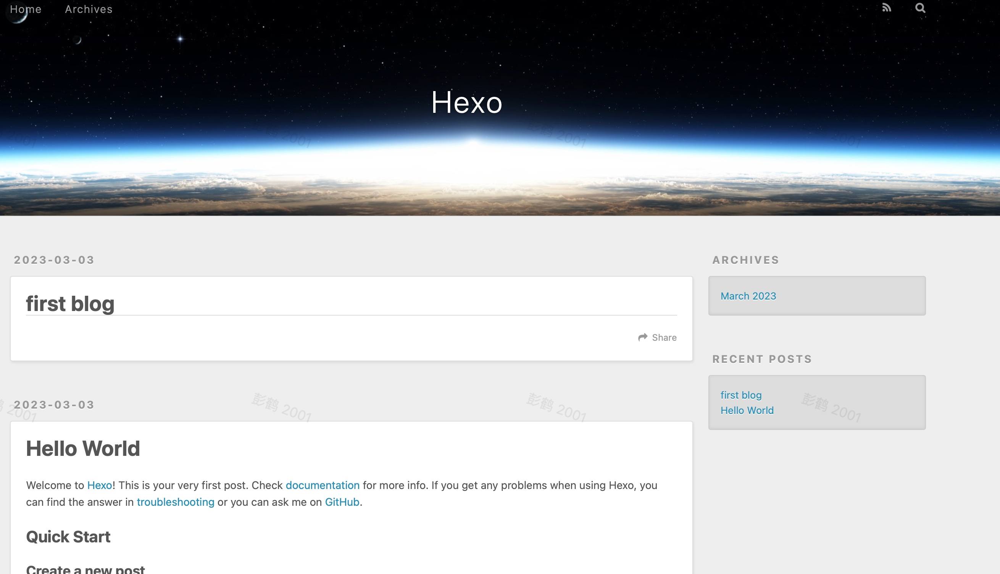

## 修改网站主题

Hexo框架默认的是landscape主题，Hexo上有三百多种主题，大家可以上Hexo官网选择自己喜欢的[主题](https://hexo.io/themes/)，我这里以next为例：

### 下载next主题

```jsx
// 下载next
git clone https://github.com/theme-next/hexo-theme-next themes/next
```

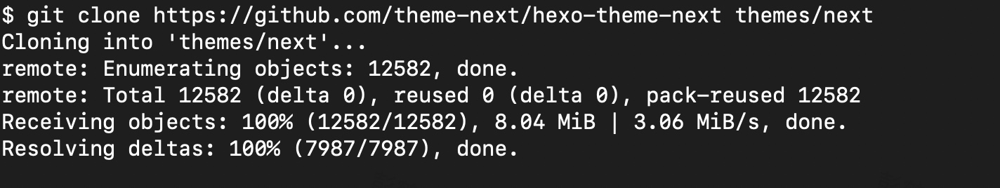

我们下载的主题都存放在Blogs/themes文件夹下：

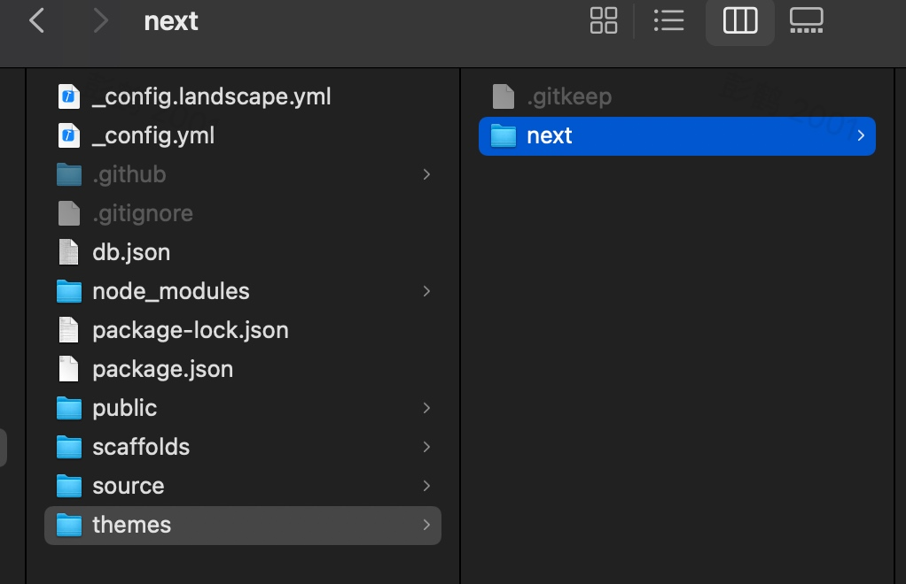

### 修改项目配置文件

主题下载下来之后，我们需要在项目配置文件_config.yml里面修改我们的主题：

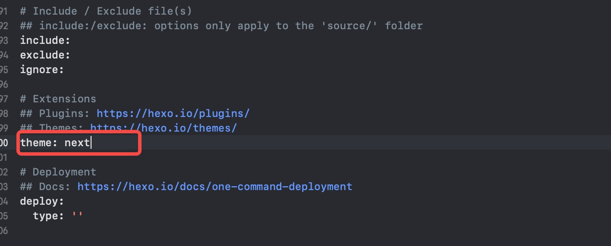

把默认的landscape修改为我们下载好的主题 next

### 重新生成项目

这时候再执行我们Hexo三连：

```jsx
// 清理项目缓存
hexo clean

// 重新生成项目
hexo g

// 本地启动项目
hexo s
```

Tips：重新生成项目和本地启动项目可以合并： *hexo g & hexo s*
再次打开项目，效果图如下：

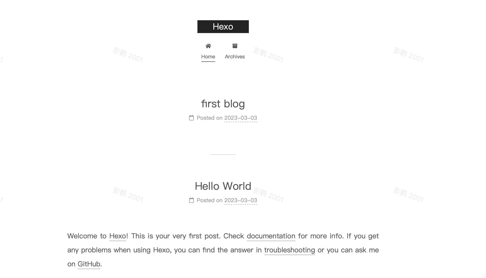

到这里，我们的主题修改就完成了，后期我们可以根据自己的需要去修改next的配置文件，让我们的博客网站更加个性化。

下一篇文章我将说说如何修改主题让我们的博客网站更具个性化。

关于Hexo搭建博客到这里就讲得差不多了，下面我们就想怎么把博客部署到Github上。

## 部署博客到Github

首先，你得要有一个自己的Github账号吧，我相信99.99%的开发者都是有Github账号的，如果你是那0.01%，请前往[Github](https://github.com)自行注册。

### 创建仓库

在Github里创建一个存放博客项目的仓库，操作如下：

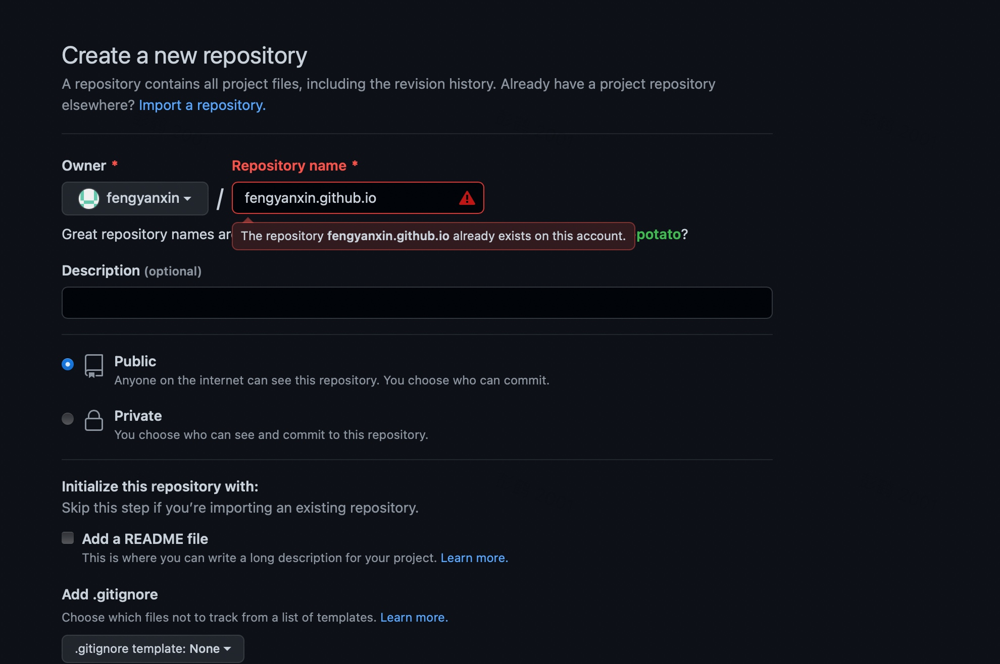

这里有几个注意点：

1. 仓库的名称必须与你Github账号名相同
2. 仓库必须以gitHub.io结尾（这里我已经创建过了，所以报错）
3. 使用GitHub Pages最好选 *Public* repo（Private需要付费）

比如你Github账号名叫：zhangsan，那你新建的这个仓库名就叫：zhangsan.github.io

创建之后，我们就有了一个存放博客项目仓库：

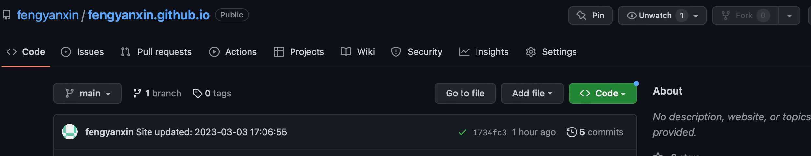

### 安装Hexo部署插件

进入到Blogs目录下，安装部署插件：

```jsx
#使用淘宝镜像安装
cnpm install --save hexo-deployer-git
```

### 修改项目配置文件

好了，万事俱备，只欠修改 *_config.yml* 文件了，打开_config.yml文件，拖拽到最后，修改文件：

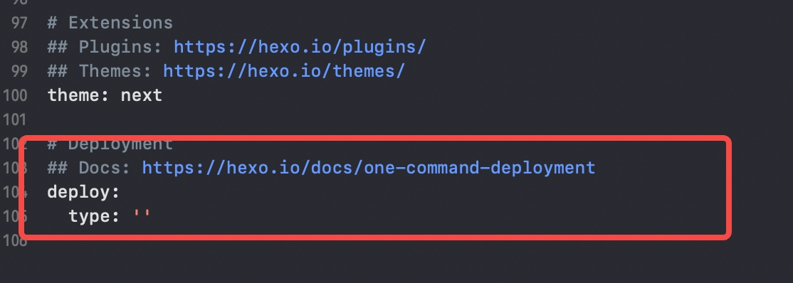

修改为：

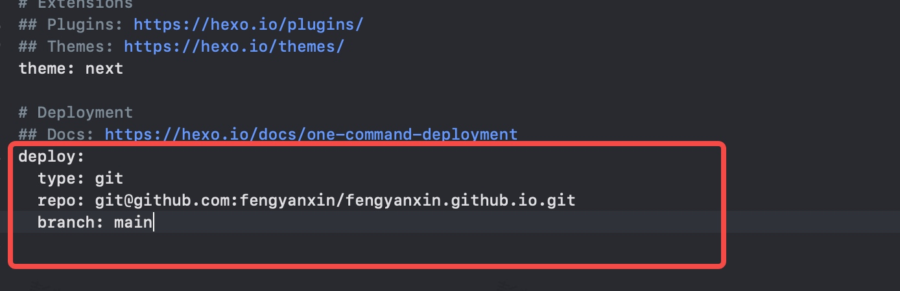

注意：*repo* 为你刚创建的Github项目的地址，如果你是使用的 *vim* 打开的 *_config.yml*，记得修改了要 *:wq* 保存退出

### 重新生成项目

清理项目缓存：

```jsx
hexo clean
```

重新生成博客：

```jsx
hexo g
```

部署到云端（Github）:

```jsx
hexo d
```

注意：这里每次使用 *hexo d* 部署到Github为了安全都要求输入账号密码，如果你不希望每次都输入账号密码，可以跟博主一样设置Github的 *SSH Keys*，以后每次发布到Github就不需要输入账号密码了。

访问云端博客主页

访问地址：https://博客仓库名.github.io
比如我的博客地址：https://fengyanxin.github.io

可以在以下路径查看：

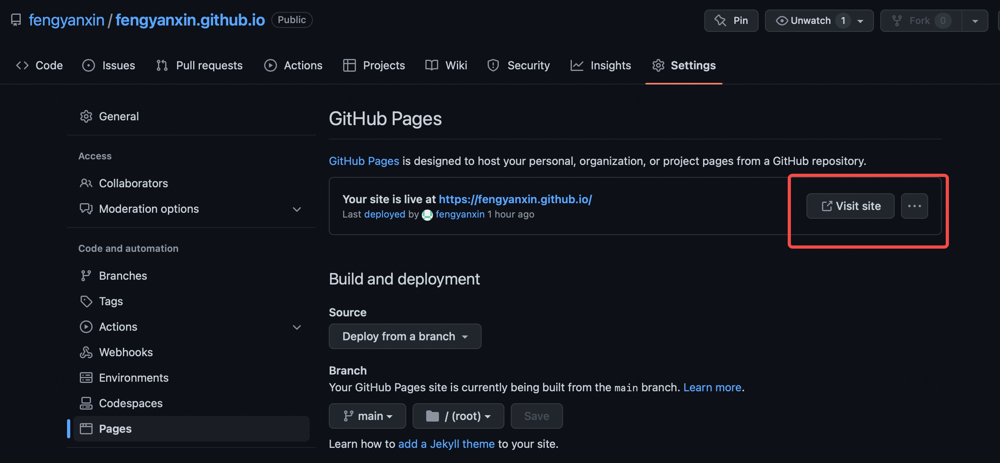

最后

基本上到这里，属于我们自己的博客就搭建完成啦，整个搭建流程如果不出错半个小时之内其实是可以搞定的，但是这路哪里那么好走呢，每个人去搭建的过程中或多或少都会遇到一些问题，我自己在搭建的过程中也碰到了一些问题，我会抽空把遇到的问题详细整理出来，希望能够帮助大家如果要搭建博客的时候少踩点坑。

大兄弟，都看到这里了，就不要吝啬你的小星星了，为博主点个赞再走吧～