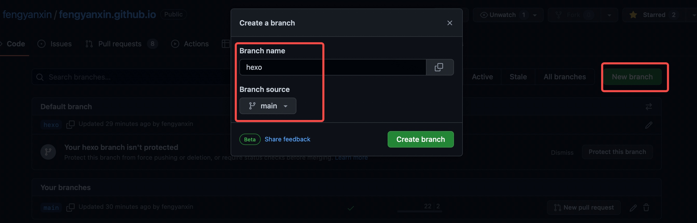
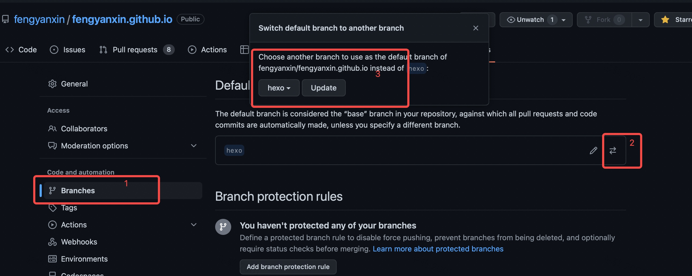
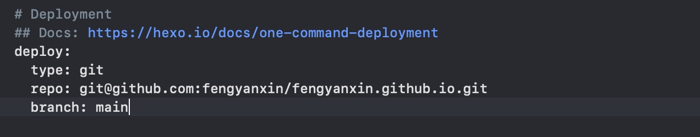

# 如何将博客源码上传到 GitHub

## 一、为什么要把博客源码上传到 GitHub ？

首先，该操作不是使用 hexo 所必须的，但是，这么做却可以让以下问题迎刃而解：

* 多台电脑同时操作 hexo 源码
* 原先 hexo 源码所在电脑重装系统（丢失文件）
* 要将 hexo 源码移动到其他磁盘（更换电脑）

<!-- more -->

将 hexo 源码上传到 GitHub，就是做了一个稳定、安全的远程备份，遇到上面的情况将不会再是什么问题。

因为，之前在 GitHub 上的部署（使用 `hexo d` 上传部署到github）其实是 hexo 编译后的文件，是用来生成网页的，不包含所有 hexo 生成的网站原始文件。只有把源码也上传才能解决问题。

## 二、如何上传博客源码？

### 1、思路分析

* `main`（`master`） 分支：存放博客的静态网页。

* `hexo`分支：存放 Hexo 博客的源码文件。

### 2、hexo 分支创建及管理

#### （1）github 准备

先在 GitHub 项目创建一个远程分支 `hexo`



将其设置为默认分支



#### (2) 打包将要推送到GitHub上的原始文件

1. clone该仓库到本地（clone的是hexo默认分支）

```js
git clone git@github.com:fengyanxin/fengyanxin.github.io.git
```

2. 下载的文件夹里仅留下 `.git` 文件夹，其他的文件都删除

3. 找见我们 hexo 原位置，将 hexo 文件夹内除 `.deploy_git` 以外都复制到clone下来的文件夹中

4. 修改 `.gitignore` 文件，将静态网页的目录及其他无需提交的源文件及目录排除掉。(没有即新建添加)

```js
.DS_Store
Thumbs.db
db.json
*.log
node_modules/
public/
.deploy*/
```

5. 如果已经 clone 过主题文件，最好把 theme 主题文件夹里的 `.git` 也删除

#### (3) 将 clone 并修改的文件夹推送到 GitHub

```js
git add .
git commit -m 'Code update'
git push origin hexo
```

### 3、main (master) 分支管理

进入**站点配置文件**，搜索 `deploy`关键词，修改如下代码：

```js
deploy:
  type: git
  repo: git@github.com:fengyanxin/fengyanxin.github.io.git
  branch: main
```



修改完成，执行以下代码进行管理：

```js
//清除本地旧代码。
hexo clean
//生成静态网站
hexo g
//部署静态网站到 GitHub 的 main(master) 分支上
hexo d
```

### 4、统一分支管理和部署

利用我上一篇文章讲到的 `deploy.sh`脚本进行一键部署，可以极大提高部署效率和降低维护成本。

在 `deploy.sh` 文件中添加如下代码：

```js
#!/bin/bash
DIR=`dirname $0`

# Generate blog
hexo clean
hexo generate
sleep 5

# Deploy
hexo deploy
sleep 5

# Push hexo code
git add .
current_date=`date "+%Y-%m-%d %H:%M:%S"`
git commit -m "Blog updated: $current_date"

sleep 2

git push origin hexo

echo "=====>Finish!<====="
```

然后附加脚本执行权限:

```js
chmod +x deploy.sh
```

然后执行即可：

```js
./deploy.sh
```

如此，便可以一键部署博客及备份博客源码到 github 的分支 `hexo` 分支上。

### 5、其他电脑源码使用

换到不同电脑上时，只需clone github 上的 hexo 分支即可：

```js
git clone git@github.com:fengyanxin/fengyanxin.github.io.git
```

