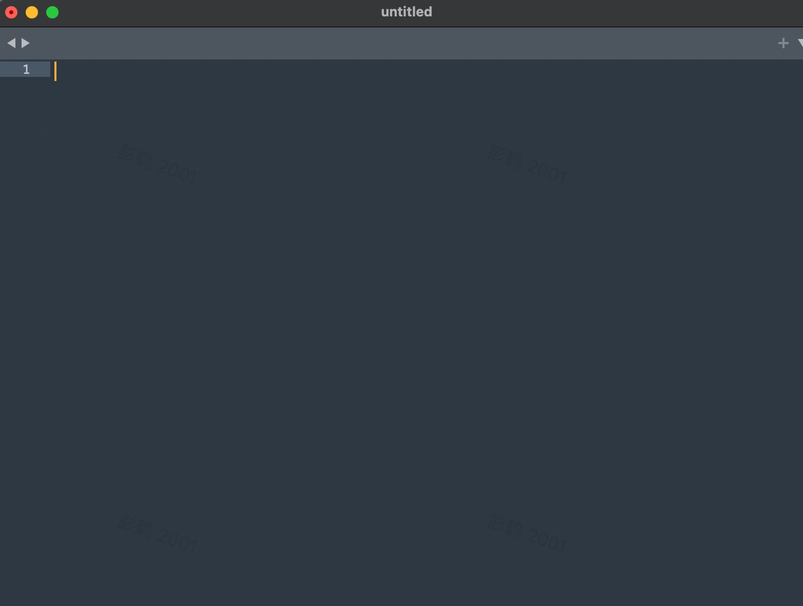
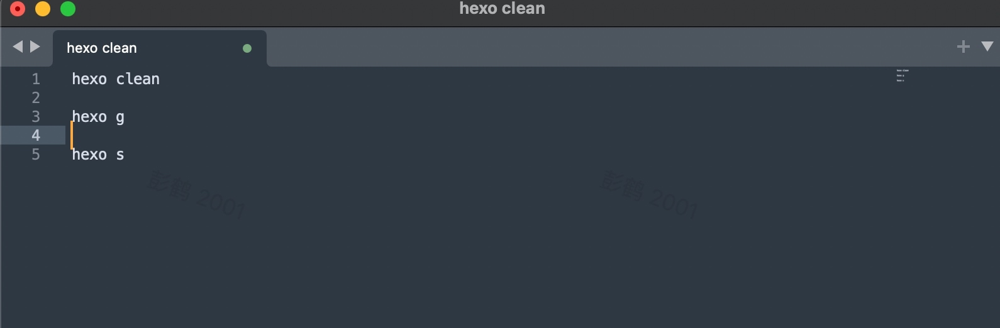
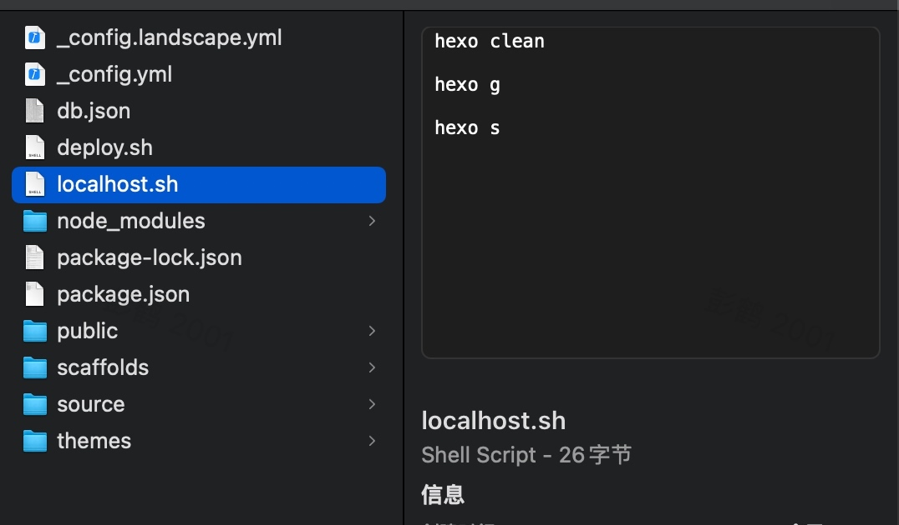

# 添加 .sh 脚本文件，快速测试和部署

## 一、创建 .sh 脚本文件

### 1.启动 Sublime Test


<!-- more -->

### 2.打开的 Sublime Test




### 3.写入或者复制进去脚本代码

此处以 Hexo localhost 测试为例

```js
hexo clean
hexo g
hexo s
```



### 4.另存为 .sh 文件，导入 hexo 文件夹



## 二、赋予脚本可执行权限

### 1.cd到编写的 .sh 文件所在目录


### 2.执行 chmod +x 指令

```js
chmod +x localhost.sh
```

### 3.执行脚本

```js
./localhost.sh
```

至此，localhost 测试脚本就完成了，部署脚本同理，在文件夹下新建一个 `deploy.sh` 文件，在其中输入以下代码即可：

```js
hexo clean
hexo g
hexo d
```

当然，添加其他助力 Hexo 快速执行的脚本亦可。