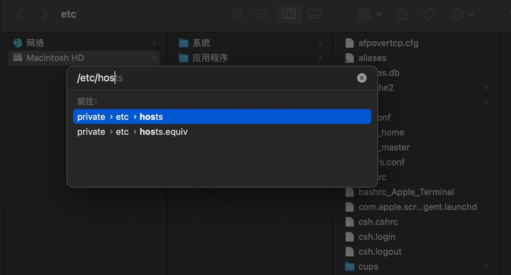
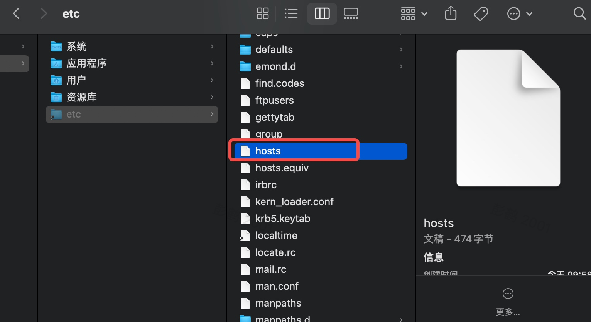
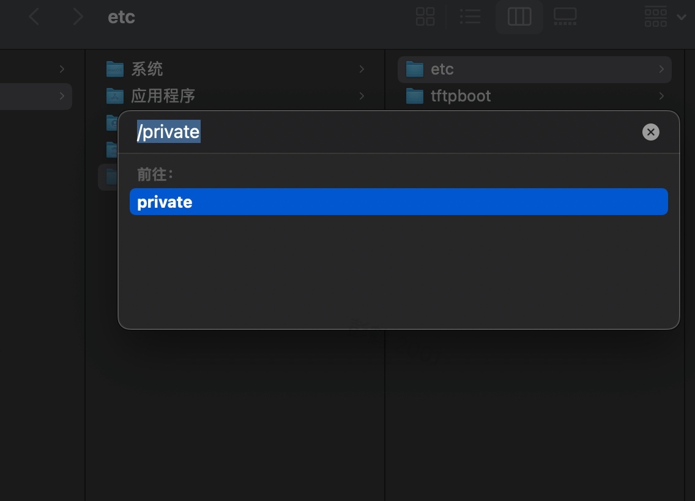
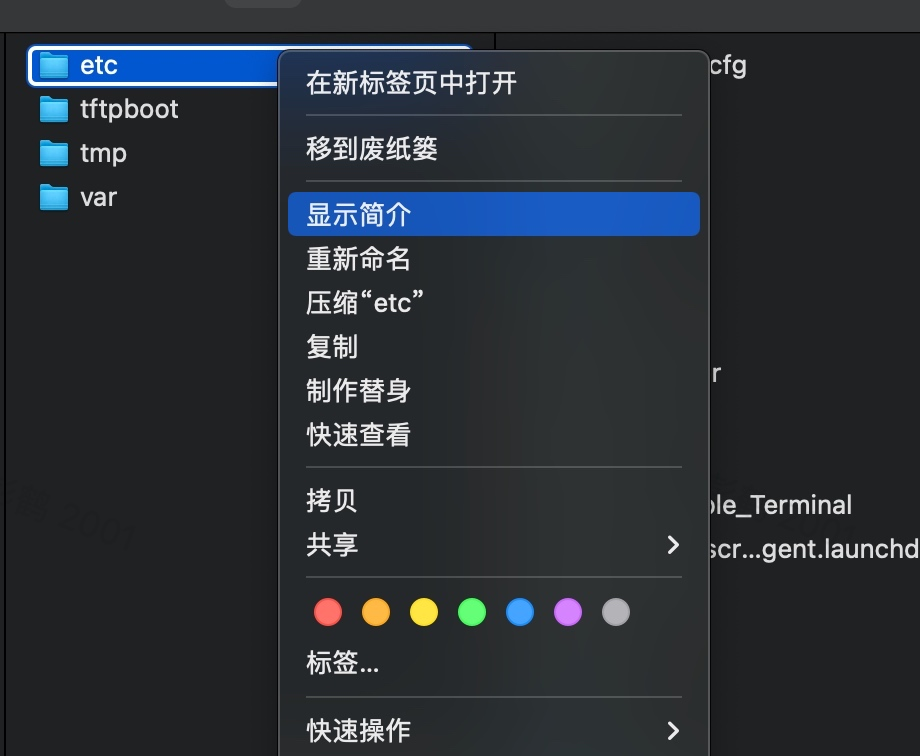
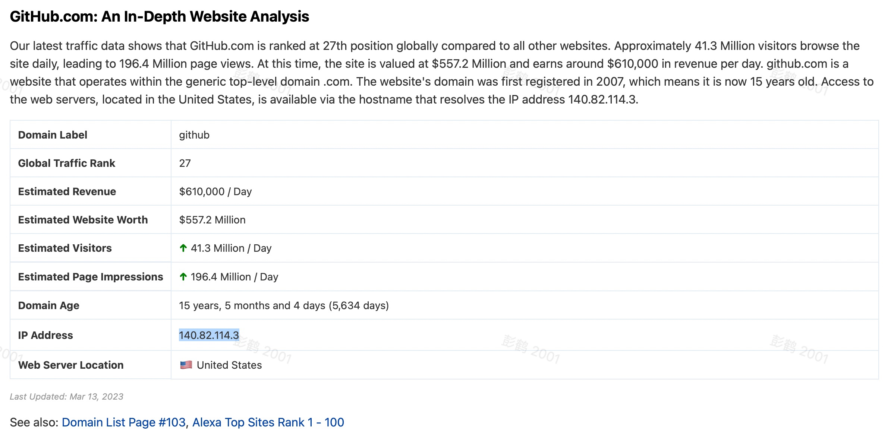
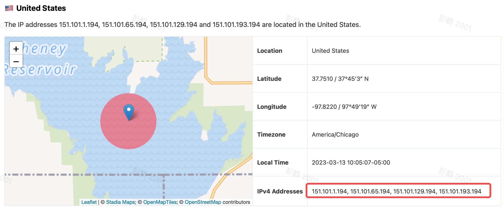

# 解决 ping github.com 超时问题

1、尝试 `ping github.com`，结果发现Ping不通，但是 `ping baidu.com` 却是正常的。


<!-- more -->

2、初步分心应该是本地的DNS无法解析导致的，需要修改Hosts文件，添加 github 的ip地址项

## 如何修改Hosts文件？

### 1、通过终端命令修改

（1）打开终端，输入命令行：

```js
# sudo 以管理员权限执行
sudo vi /etc/hosts
```

（2）输入本机密码后，会自动打开hosts文件 。

* 键盘输入`i`（插入），修改完成后，按 `esc` 键退出插入页面
* 保存退出：输入  `:wq` 或者`:wq!`，再`enter`键 
* 不保存退出：输入`q`和`！`键，再`enter`键

### 2、在 Finder 中修改

方法一：

（1）打开 `Finder` ，快捷键 `Command+Shift+G` 查找文件，输入 `/etc/hosts`，点击前往




（2） 复制hosts文件到桌面，修改成功后替换原hosts文件即可




方法二：

（1）打开Finder，快捷键 `Shift+Command+G` 查找文件，输入 `/private` 前往




（2）找到 `etc` 文件之后，选择显示简介




（3）找到共享与权限，将everyone的权限修改为读和写，保存后修改hosts文件，修改成功后记得把权限修改回来！


## 如何在 Hosts 文件中配置 github.com 映射

host文件打开之后可以看到：


在文件下面添加如下代码：

```js
#GitHub地址
140.82.114.3 github.com git
151.101.129.194 github.global.ssl.fastly.net
```

上图中的 IP 可以通过， [ipaddress](https://www.ipaddress.com) 网站查询，输入网址就可查阅到对应的IP地址。（这是一个查询域名映射关系的工具）




`140.82.114.3`：这个IP地址修改为 `github.com`搜索到的IP地址




`151.101.129.194`：这个IP地址修改为`github.global.ssl.fastly.net`搜索到的
IP地址，其中可能会有多个，挑选其中一个即可。

添加完成，重新在终端 `ping github.com`，发现可以 ping 通了， 如下图：


