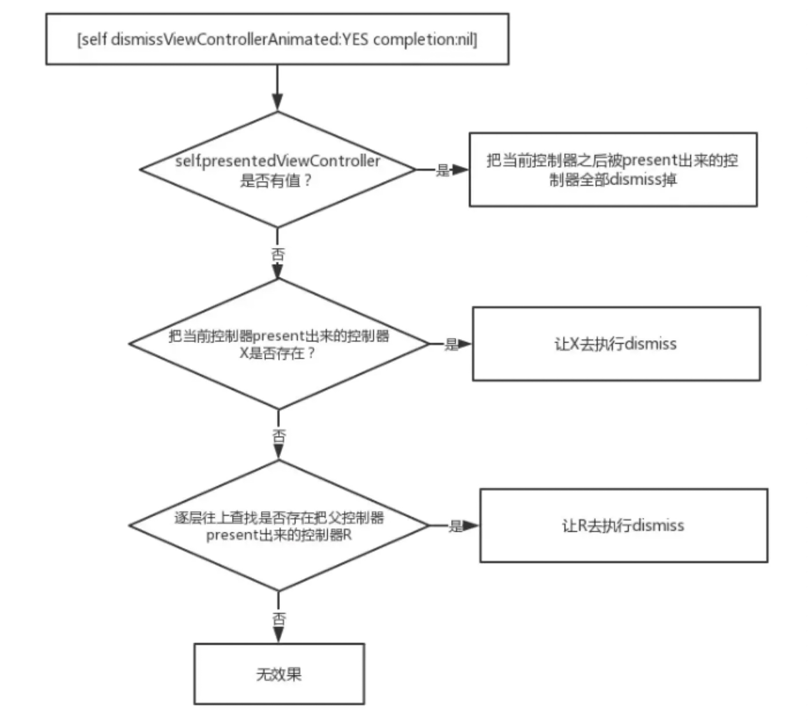

### 前言

工程中有个多层控制器时，调用 `dismissViewControllerAnimated` 时不时会不起作用。

### 原理

我们都知道 `dismissViewControllerAnimated:completion:` 方法是针对被 `present` 出来的控制器的。

一般我们这样使用：在一个控制器中 `present` 另外一个控制器A，然后在A中执行 `dismissViewControllerAnimated:completion:` 让自己消失。

<!-- more -->

在 `ViewController`中：

``` swift
AViewController *av = [[AViewController alloc] init];
UINavigationController *nav = [[UINavigationController alloc] initWithRootViewController:av];
[self presentViewController:nav animated:YES completion:nil];
```

在 `AViewController` 中执行 `disimiss`：

``` swift
[self dismissViewControllerAnimated:YES completion:nil];
```

对于上面这种常见的场景，这种用法完全没问题。

但是对于复杂一点的场景，这种用法就有点苍白无力了，先举个稍微复杂一点点的例子：

`ViewController present AViewController`，`AViewController present BViewController`，在 `BViewController` 执行完某事件之后需要返回 `ViewControlle`。这个时候需要怎样做呢？如果在 `BViewController` 直接执行 `[self dismissViewControllerAnimated:YES completion:nil];` 的话，它只会将 `BViewController` 消失。

这里你可能会想到通过其他方式拿到 `AViewController`，然后调用 `AViewController的[self dismissViewControllerAnimated:YES completion:nil];`。但是，场景再复杂一点，在执行完各种 `present` 和 `push` 之后，到达了 `XViewController`，在 `XViewController` 中执行成功任务之后需要回到 `ViewController`，这个时候怎么办呢？我们知道当前如果有被 `present` 出来的控制器的情况下，调用 `UINavigationController` 的 `popToRootViewControllerAnimated:` 是不起作用的。

那么我们如何把这个流程中所有被 `present` 和 `push` 的控制器给销毁呢？笨一点的办法是回溯整个流程，判断哪些控制器需要 `dismiss`，哪些控制器需要 `pop`。但这种方式显然有点低效和难以控制，下面我们来看看到底该怎么使用 `dismissViewControllerAnimated:completion:`。

我们先看看官方文档到底怎么讲的：

>Dismisses the view controller that was presented modally by the view controller.
>
>The presenting view controller is responsible for dismissing the view controller it presented. If you call this method on the presented view controller itself, UIKit asks the presenting view controller to handle the dismissal.
>
>If you present several view controllers in succession, thus building a stack of presented view controllers, calling this method on a view controller lower in the stack dismisses its immediate child view controller and all view controllers above that child on the stack. When this happens, only the top-most view is dismissed in an animated fashion; any intermediate view controllers are simply removed from the stack. The top-most view is dismissed using its modal transition style, which may differ from the styles used by other view controllers lower in the stack.
>

可以简单归纳为两点：

1. 谁 `present` 出来的控制器，谁负责把它 `dismiss` 掉，但是如果你在被 `present` 出来的控制器中调用 `dismiss` 的话，UIKit会自动让它的 `presenting` 控制器（找到谁把它present出来的）去执行 `dismiss`。
 
2. 如果你 `present` 了一系列的控制器，那么系统会把被 `present` 出来的控制器放在一个栈中，当处在底层的控制器执行 `dismiss` 的时候，在它之后被 `present` 出来的控制器都会被移除，只有栈顶上的控制器会有 `dismiss` 动画。

另外补充相关的两点：

1. 当被 `present` 出来的控制器的 `modalPresentationStyle = UIModalPresentationFullScreen` 时，执行当前 `present` 事件的控制器必须是一个全屏控制器，如果当前执行的控制器不是一个全屏的控制器，它将在视图层级结构中找到一个全屏的父类控制器去执行 `present` 事件。也就是说如果 `A` 执行 `present B`，那么 `B.presentingViewController` 不一定是 `A`。比如你当前的控制器 `A` 在导航 `nav` 中，`A present B` 之后，实际上 `B.presentingViewController` 指向的是 `nav` 而不是 `A`。

2. `self.presentingViewController`，它指向的是把当前控制器 `present` 出来的控制器或者是把当前控制器的最上层的父类 `present` 出来的控制器。

通过上面的文档介绍，我们可以看到在本文刚开始介绍的最简单的使用场景下 `（ViewController present AViewController）`，在 `AViewController` 中执行 `[self dismissViewControllerAnimated:YES completion:nil]` 和在 `ViewController` 中执行 `[self dismissViewControllerAnimated:YES completion:nil]` 效果是一样的，这一点是因为系统帮我们处理好了（因为系统判判 `AViewController` 当前没有 `present` 出来任何控制器，所以系统会找到它的 `presentingViewController`，也就是 `ViewController` 来执行 `dismiss` 事件）。

在复杂一点的情况下，比如我们要 `dismiss` 掉当前被 `present` 出来的控制器的话，我们就需要想办法拿到处在栈底的那个控制器，在这个控制器中执行 `[self dismissViewControllerAnimated:YES completion:nil]` 才行。

那么很显然，执行 `[self dismissViewControllerAnimated:YES completion:nil]` 的流程是这样子的：



在我们上面讲的复杂场景下，我们怎么一次性把当前 `present` 出来的控制都 `dismiss` 掉呢？可以通过下面的方式来查找到最顶层的 `presentingViewController`（其实，通常是我们 `window` 的 `rootViewController`）让它来执行 `dismiss` 就好了，剩下的工作可能就是处理一下导航中的控制器了。

比如我们在经过各种 `present` 和 `push` 之后才到达的 `XViewController` 页面中执行如下代码：

```
UIViewController *presentingVc = self.presentingViewController;
while (presentingVc.presentingViewController) {
    presentingVc = vc.presentingViewController;
}
if(presentingVc){
    [presentingVc dismissViewControllerAnimated:YES completion:nil];
}
```

### 参考

[https://www.jianshu.com/p/ea5af4057d64](https://www.jianshu.com/p/ea5af4057d64)


