# 集成阿里云消息推送

## 基本的业务流程：

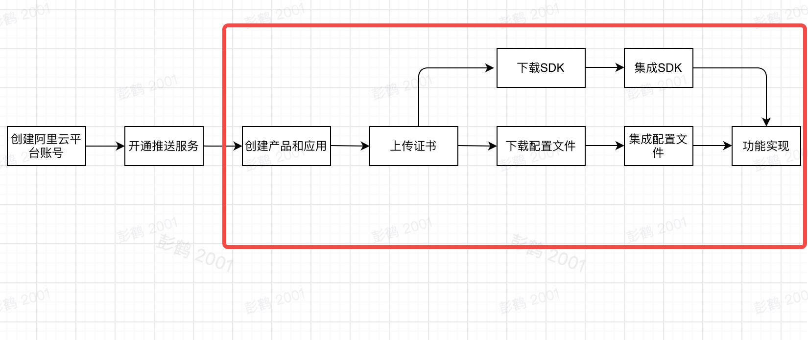

<!-- more -->

集成阿里云消息推送的流程基本如上图所示，还是比较简单的，我们只需要重点关注一下红框中的部分。

下面我们就来分步骤讲解一下：

### 一：创建应用

创建应用获取初始化推送所需的AppKey和Secret

#### 1. 登录阿里云控制台，添加产品

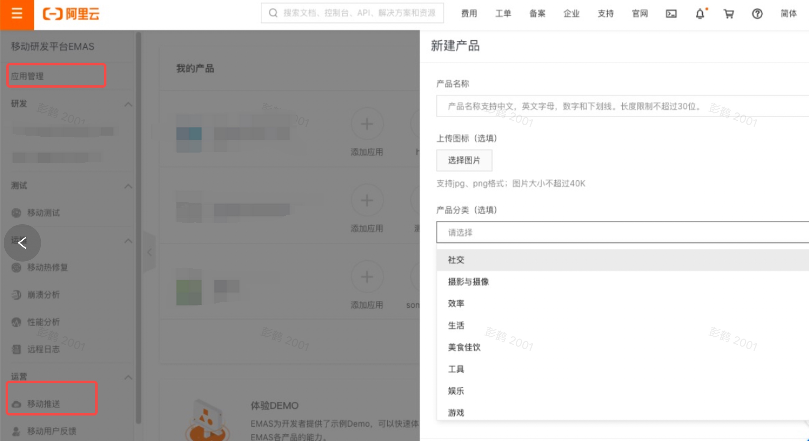

#### 2. 点击添加应用，创建ios和android对应的平台

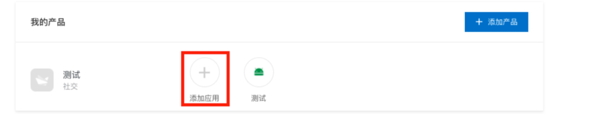

### 二：上传证书

集成阿里云推送，我们需要在阿里云控制台上传两个证书，分别是**开发环境的推送证书**和**生成环境的推送证书**，如下图所示：


那么我们要如何获取这两个证书呢？

#### 1.获取CSR文件

1.1 在Mac的应用程序中打开钥匙串访问，在顶部菜单栏中选择钥匙串访问>证书助理>从证书颁发机构请求证书

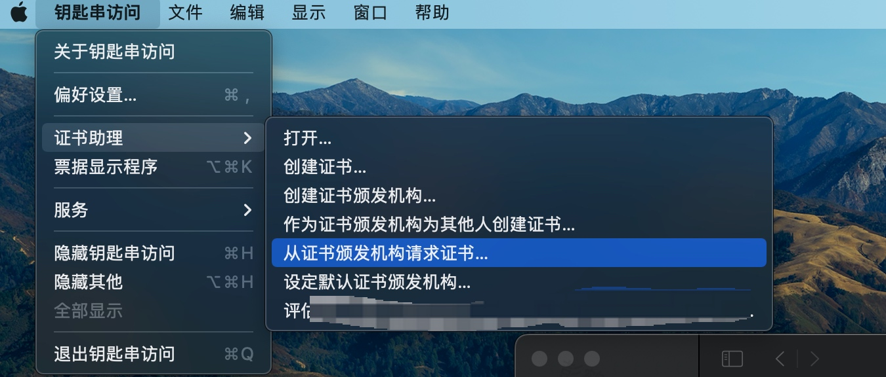

1.2 在弹出的证书信息中，输入邮箱地址，设置选择储存到磁盘，单击继续将CSR文件存储到本地

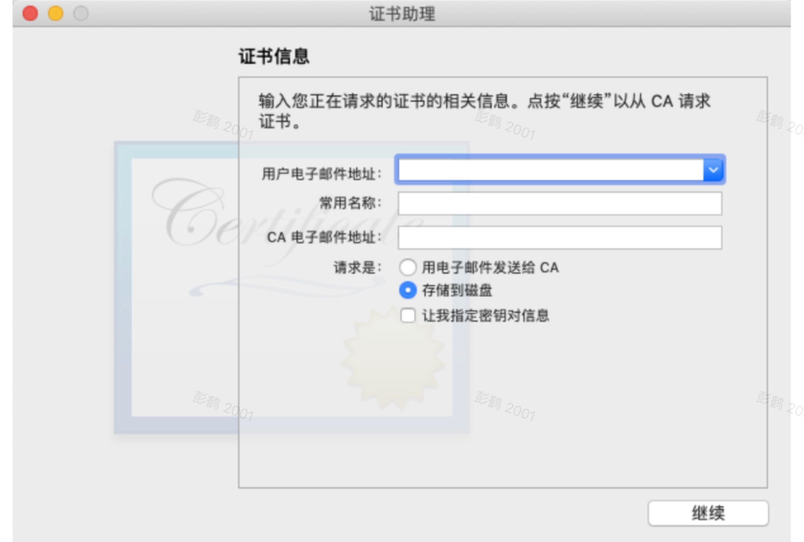

1.3 生成之后，在目录下找到此文件

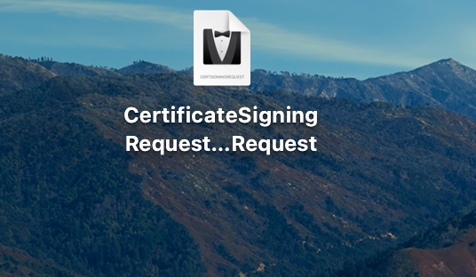

#### 2.生成AppID

2.1 登录 [Apple Developer](https://developer.apple.com/account)，选择Certificates，Identifiers & Profiles选项

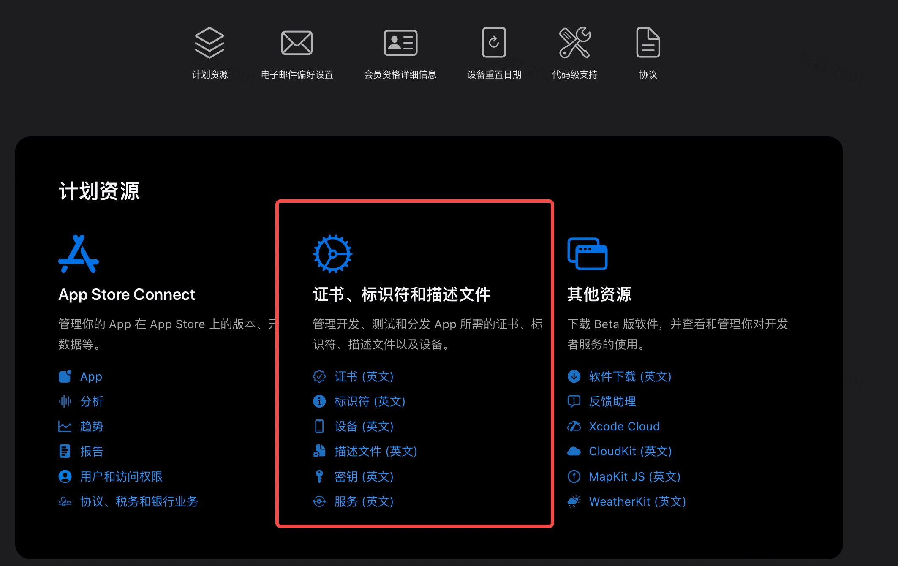

2.2 选择Identifiers，项目如果是自动证书管理的话我们可以看到一些以 `XC`开头的 Bundle ID ，如下图所示：

如果是手动证书管理，需要点击`+`号创建 App ID，此处我们自动证书管理为例。

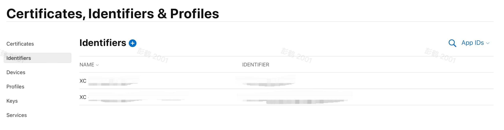

2.3 在上图的 Identifiers 列表中选择需要配置推送的
Bundle ID。（如果列表中没有，可以在Xcode工程中配置）

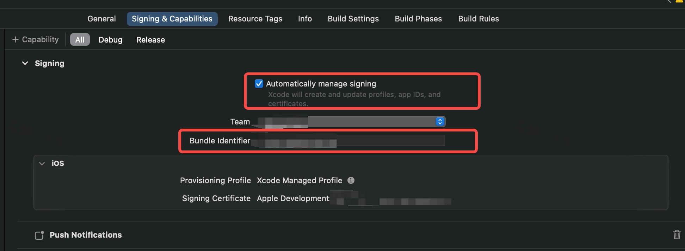

在上图配置文件中填写Bundle ID，然后勾选`Automatically manage signing`，在下图弹框中选择`Enable Automatic`，然后回到[Apple Developer](https://developer.apple.com/account)，就可以`Identifiers`列表中看到我们刚才设置的`Bundle ID`了。

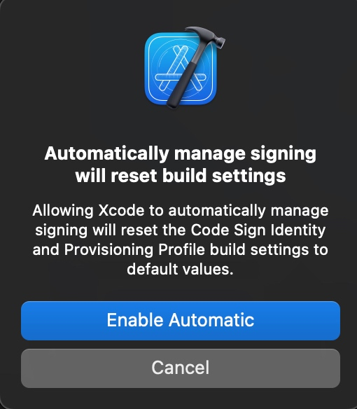

2.4 点击Identifiers 列表进入详情，向下划动找到`Push Notification`选项，勾选开启远程推送服务

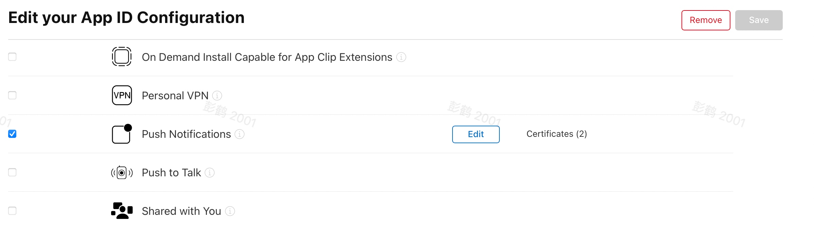

#### 3.创建生产和开发推送证书

3.1 点击上图中的`Edit`按钮，进入配置页面

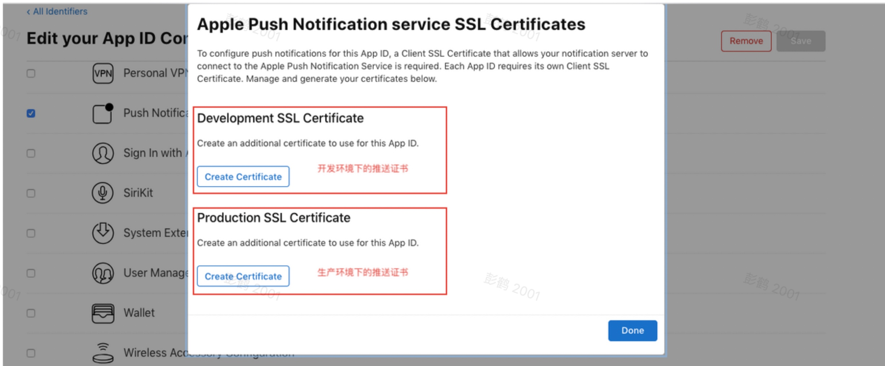

3.2 单击`Choose File`上传已获取到的CSR文件

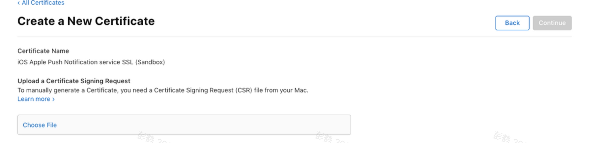

3.3 生成后，`download`到本地

3.4 双击打开并安装证书，系统会自动将其导入到钥匙串中

3.5 在Mac中打开钥匙串应用，选择登录>证书，分别右键导出开发环境（`Apple Sandbox Push Services`）和生产环境(`Apple Push Services`)的`.P12`证书文件

<font color=#ff0000>此处导出.p12文件时需要设置密码，阿里云配置证书时必填</font>

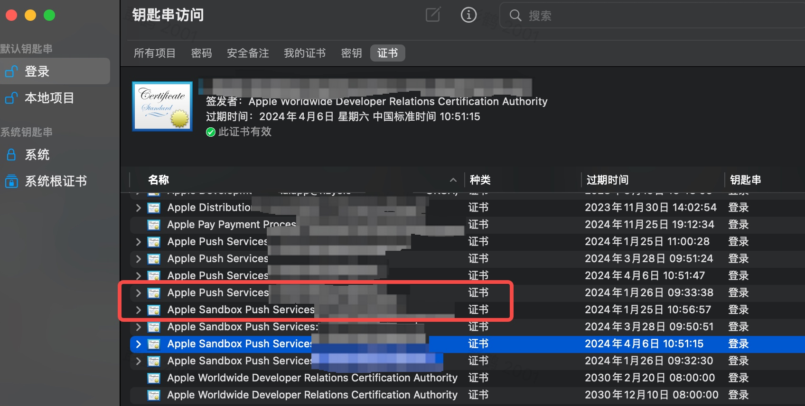

导出结果如下：

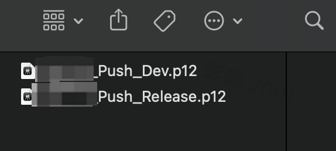

3.6 在阿里云控制台配置相应的开发和生产证书，如下图所示：

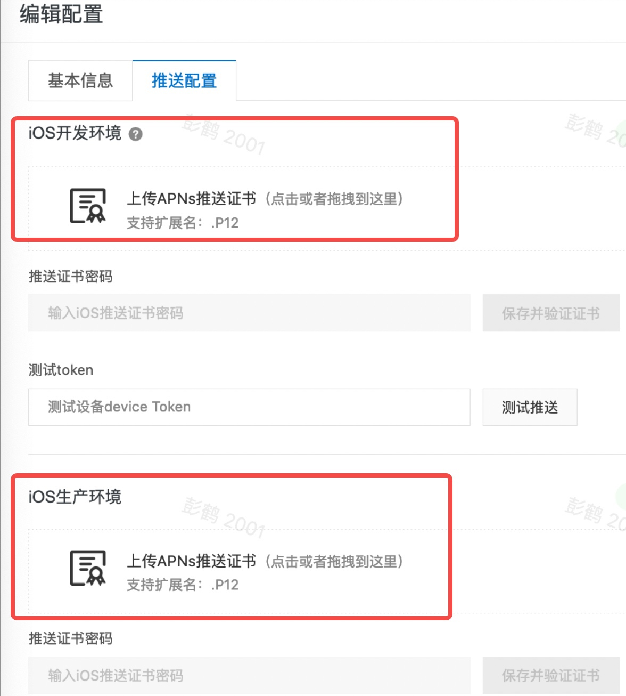


### 三：下载配置文件并集成

1.在阿里云控制台应用设置找到相应应用，点击`iOS配置下载`，将我们刚才生成好的配置文件下载下来，如下图所示：

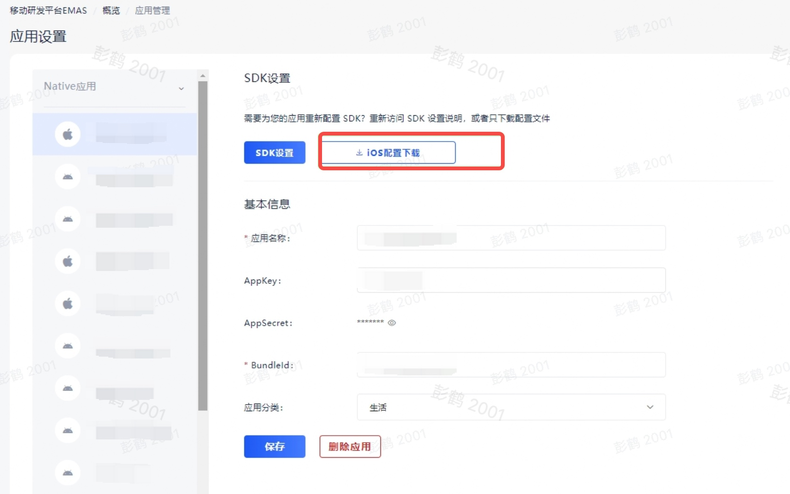

下载完成之后，文件如下图：

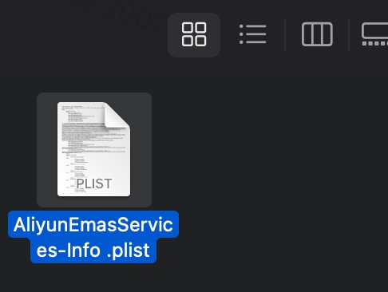

将此文件导入到工程中，可以通过`CloudPushSDK.autoInit`方法自动生成推送配置，下文**功能实现**模块我们将做详细介绍。

### 四：下载推送SDK与集成

#### 1.集成SDK

一共有两种方法，手动集成和Pod集成，这里我们主要介绍pod集成的方法。

1.1 在Podfile中添加阿里云仓库source源

```
source 'https://github.com/aliyun/aliyun-specs.git'
```

1.2 pod 阿里云推送

```
pod 'AlicloudPush', '~> 1.9.9.5'
```

#### 2.引入头文件

```
import CloudPushSDK
```

或者OC桥接文件中引入

```
#import <CloudPushSDK/CloudPushSDK.h>
```

#### 3.Objc配置

iOS端集成SDK时需要做`-ObjC`配置 ，即应用的 *TARGETS -> Build Settings -> Linking -> Other Linker Flags* ，需添加上`-ObjC`这个属性，否则推送服务无法正常使用 。

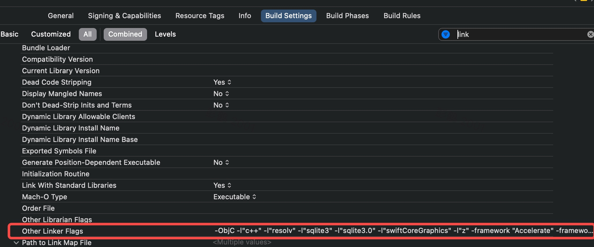

#### 4.打开系统通知

<font color=#ff0000>注意：此处千万不要忘记打开，否则收不到推送，这是一个小点，很难定位</font>

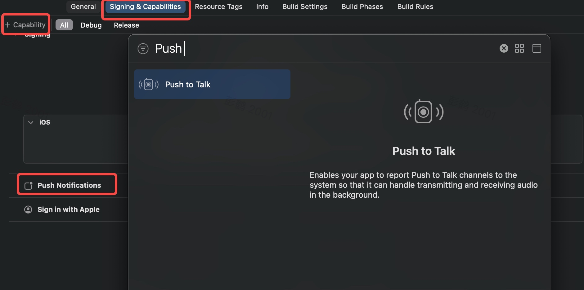


### 五：功能实现

推送功能主要在`AppDelegate`文件中实现

#### 1.初始化SDK

使用配置文件`AliyunEmasServices-Info.plist`直接调用`autoInit`，这个在前文有提到过。

```swift
func setup(_ application: UIApplication, launchOptions: [UIApplicationLaunchOptionsKey: Any]?) {
    CloudPushSDK.autoInit { result in
        guard let result = result else {
            log.error("Push SDK init failed, error: result is nil!")
            return
        }
        if result.success {
            log.debug("Push SDK init success, deviceId: \(String(describing: CloudPushSDK.getDeviceId()))")
        } else {
            log.error("Push SDK init failed, error: \(String(describing: result.error))")
        }
    }

    //...
    // 点击通知将App从关闭状态启动时，将通知打开回执上报
    CloudPushSDK.sendNotificationAck(launchOptions)
}
```

#### 2.请求通知权限并注册远程通知

第一次安装会弹出请求通知的`alert`

```swift
func registerAPNS(application: UIApplication) {
    let center = UNUserNotificationCenter.current()
    center.delegate = self
    var options: UNAuthorizationOptions = [.alert, .sound, .badge]
    if #available(iOS 12.0, *) {
        options = [.alert, .sound, .badge, .providesAppNotificationSettings]
    }
    center.requestAuthorization(options: options) { (granted, error) in
        if granted {
            log.debug("User authored notification.")
            DispatchQueue.main.async {
                application.registerForRemoteNotifications()
            }
        } else {
            log.debug("User denied notification.")
        }
        if let error = error {
            log.error(error)
        }
    }
}
```

#### 3.注册设备并上报deviceToken

```swift
func registerDevice(_ deviceToken: Data) {
    CloudPushSDK.registerDevice(deviceToken) { result in
        guard let result = result else {
            log.error("Register deviceToken failed, error:: result is nil!")
            return
        }
        if result.success {
            log.debug("Register deviceToken success, deviceToken: \(String(describing: CloudPushSDK.getApnsDeviceToken()))")
        } else {
            log.debug("Register deviceToken failed, error: \(String(describing: result.error))")
        }
    }
}

public func application(_ application: UIApplication,
                        didRegisterForRemoteNotificationsWithDeviceToken deviceToken: Data) {
    registerDevice(deviceToken)
}

// 注册失败
public func application(_ application: UIApplication,
                        didFailToRegisterForRemoteNotificationsWithError error: Error) {
    log.error("did Fail To Register For Remote Notifications With Error : \(error)")
}
```

#### 4.注册通知类别

通知类别（category）用于给通知分类，可添加按钮或自定义UI

```swift
func createCustomNotificationCategory() {
    let action = UNNotificationAction(identifier: "actionID", title: "buttonTitle", options: [])
    let category = UNNotificationCategory(identifier: "CategoryID", actions: [action],
                                          intentIdentifiers: [],
                                          options: .customDismissAction)
    UNUserNotificationCenter.current().setNotificationCategories([category])
}
```

#### 5.UNUserNotificationCenterDelegate

`UNUserNotificationCenterDelegate`代替了`UIAppDelegate`的旧通知接收方法`didReceiveRemoteNotification`将接收通知的情况分为app开启时（foreground）和app不在前台时（background）

```swift
// app打开时调用
public func userNotificationCenter(_ center: UNUserNotificationCenter,
                                   willPresent notification: UNNotification,
                                   withCompletionHandler completionHandler: @escaping (UNNotificationPresentationOptions) -> Void) {
    // 业务逻辑
    handleNotification(notification)
    
    // 在app内弹通知
    completionHandler([.badge, .alert, .sound])
}

// app未打开时调用
public func userNotificationCenter(_ center: UNUserNotificationCenter, didReceive response: UNNotificationResponse, withCompletionHandler completionHandler: @escaping () -> Void) {
    let userAction = response.actionIdentifier
    if userAction == UNNotificationDefaultActionIdentifier { 
        // 点击通知栏本身
        log.debug("User opened the notification.")

        handleNotification(response.notification)

    } else if userAction == UNNotificationDismissActionIdentifier {
        // 通知dismiss，category创建时传入UNNotificationCategoryOptionCustomDismissAction才可以触发
        log.debug("User dismissed the notification.")
    } else if userAction == "actionID" {
        // 自定义按钮逻辑
    }

    completionHandler()
}

// iOS12新功能，在app系统通知设置里点击按钮跳到app内通知设置的回调
public func userNotificationCenter(_ center: UNUserNotificationCenter, openSettingsFor notification: UNNotification?) {
    log.debug("Open notification in-app setting.")
}
```

## 扩展功能：Notification Service Extension（富媒体推送）

众所周知，苹果的apns推送有一个痛点（当然Apple觉得这是亮点），就是**在我们不点击通知时，app是不会执行任何代码的**，这就是静默推送，虽然app能收到推送，但是它不执行任何代码，这极大的保护了手机性能，却也让开发者没办法对推送内容进行修改了。

那么问题来了，Apple真的不让开发者动态修改推送内容了吗？

不然，Apple还是很有良心的，在静默推送修改之后，它也推出了另一功能`Notification Service Extension`，它为我们完美解决了对推送内容进行动态修改的需求，接下来我们就来看一下这一功能：

### 了解Notification Service Extension

* iOS 10添加了通知相关的扩展Notification Service Extension，使得通知弹出前可以对通知内容进行修改。

* iOS远程推送过程如下图所示，APNs推送的通知直接在设备上弹出；

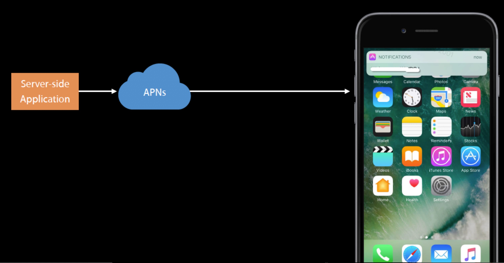

* 添加Notification Service Extension后，如下图所示，APNs推送的通知在弹出前，可先到达Extension进行处理。

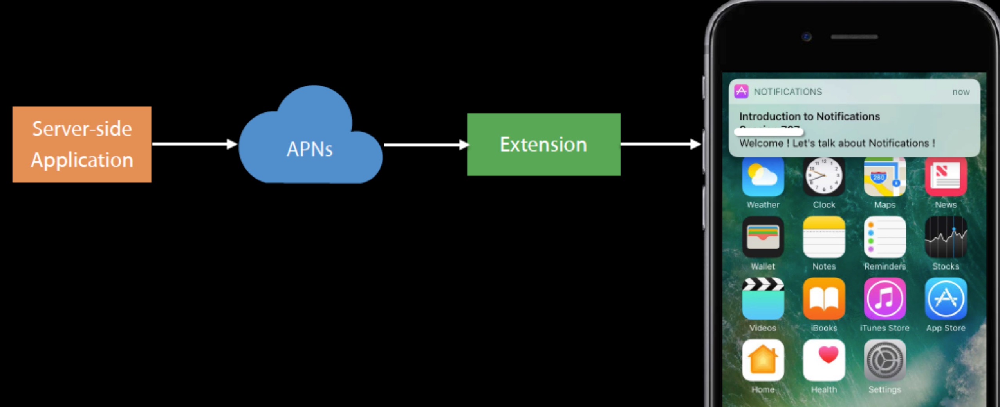


<font color=#ff0000>【注意】OpenAPI 需要调用 setiOSMutableContent(true) 接口，这样Extension才可生效。这里的OpenAPI就是阿里云API了，让后台配置一下setiOSMutableContent(true)就好。</font>

### 使用Notification Service Extension

#### 1、点击 file->new->target

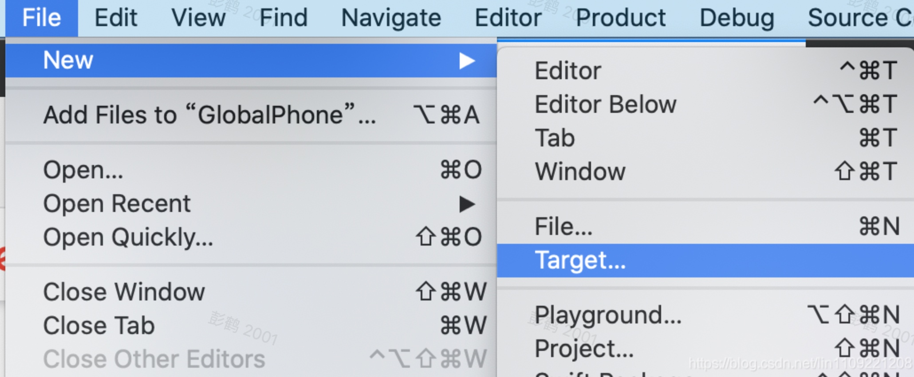

#### 2、选择 iOS->Notification Service Extension

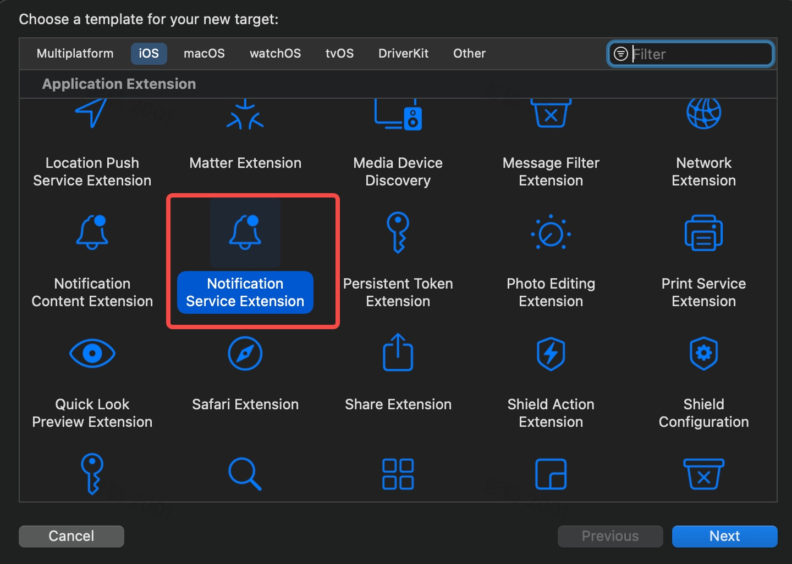


#### 3、选择创建extension的项目target，输入扩展名称，点击finish，即创建扩展完成

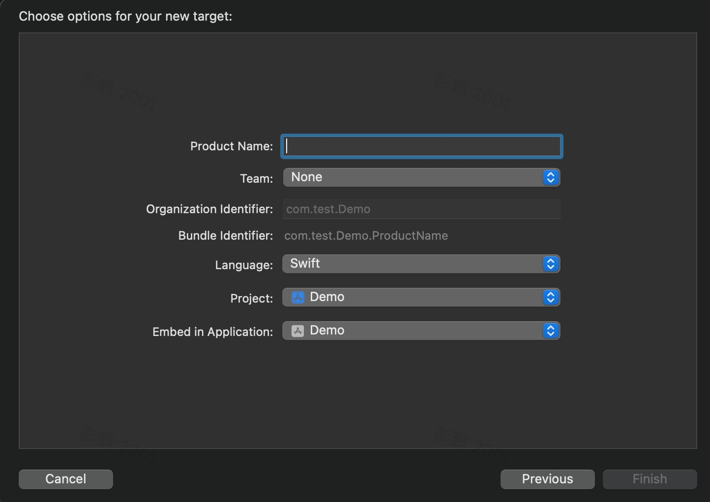

### 配置Extension

创建完成后，主要有两个文件`NotificationService.swift` 和 `info.plist`

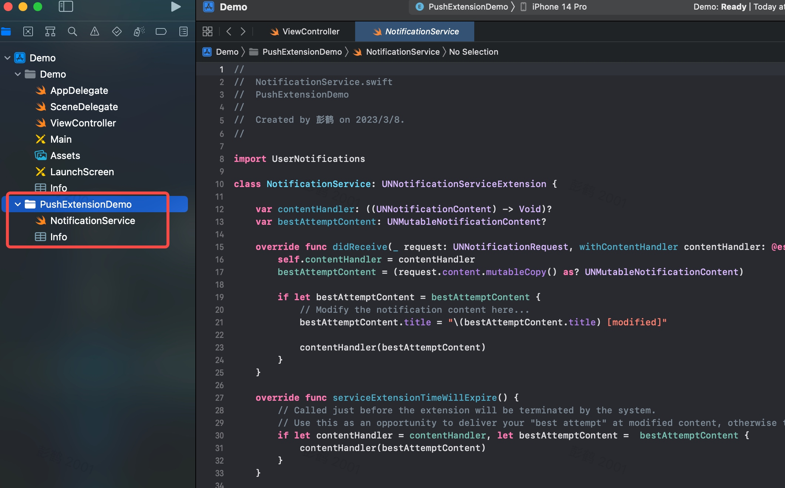


1、首先，需要在扩展对应的target->Signing&Capabilities，点击+Capability，添加push notification

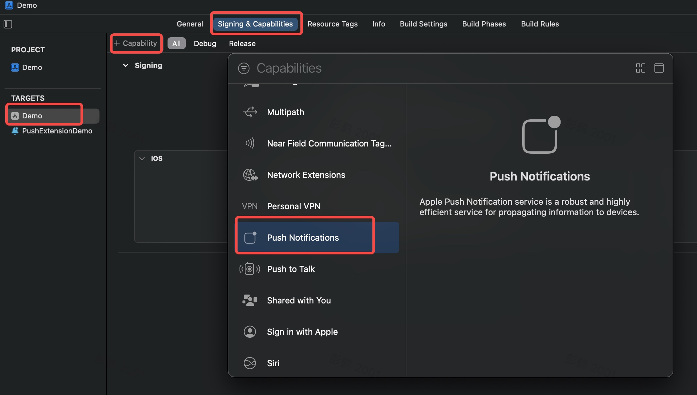

2、`NotificationService.swift`中主要有两个方法

1）

```swift
override func didReceive(_ request: UNNotificationRequest, withContentHandler contentHandler: @escaping (UNNotificationContent) -> Void)
```

该方法主要是用于在接受到推送时，针对推送内容进行修改，修改完成后展示给用户

2）

```swift
override func serviceExtensionTimeWillExpire()
```

该方法是用于在方法1）中如果没有向用户展示推送，可以在这里（即apns即将到30s时）向用户推送

3、推送的消息中必须具备alert和`"mutable-content":"1"`（表示推送可修改），这个上文有提到过，OpenAPI 需要调用 `setiOSMutableContent(true)` 接口，发送出来的消息结构中就会有`"mutable-content":"1"`。

接下来，我们就可以对接收到的推送消息做自定义动态修改了。如下图所示：

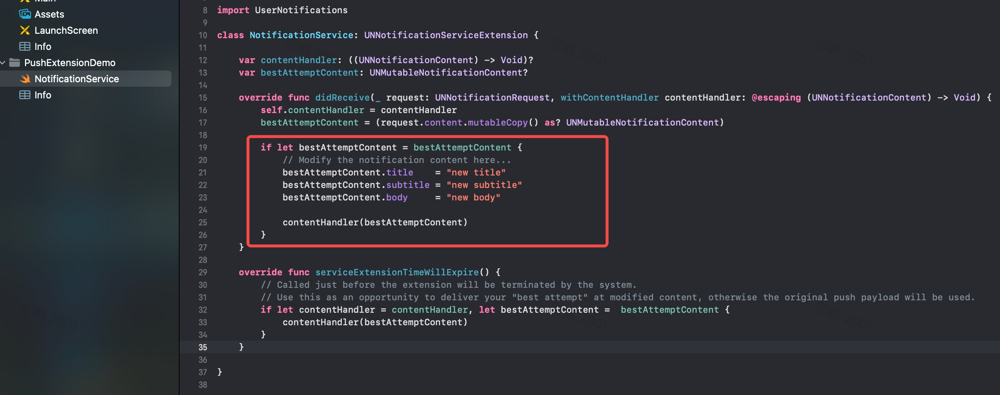

然后我们就可以看到手机接收到的推送变了。

🎉🎉🎉 完结撒花 🎉🎉🎉！

❤️ Best wish for you ❤️！

