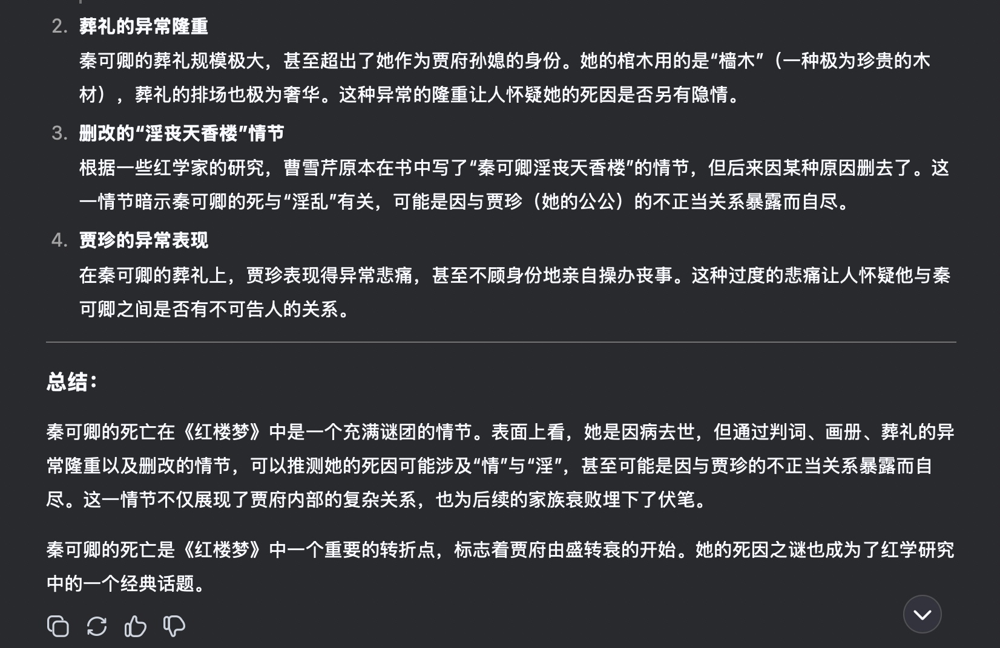

# 第一次与 DeepSeek 闲聊

## 认知

问问他是谁？

<!-- more -->

猜猜我是谁？

初步探索，发现 DeepSeek 在认知方面非常清晰。

## 文学性

让 DeepSeek 写写诗，讨论一下 我最喜欢的文学作品《红楼梦》。

DeepSeek 在写诗和作词方面的能力可以说是非常优秀了。但是还是有一个弊端，同样的问题再提一遍的话，可能还是相同的回答。

对比一下 ChatGPT 的回答：

可以说， DeepSeek 是全面领先了！

继续往下，看一下 DeepSeek 对红楼梦细节的了解和理解。

再对比一下 ChatGPT：

是不是又碾压了。

接下来问一个经典问题：

这个回答真的太厉害了，对比 ChatGPT ：

ChatGPT 简直连小学生都不如！

最后一个问题，重写红楼梦结局，这个也是我非常喜欢问 AI 的问题。

这个回答中规中矩，非常符合原著设定。

对于红楼梦的了解和理解，DeepSeek 还是有一定深度的，但是有时候，它也会捏造一些事实，让它们看起来煞有介事，了解内情的人一看就知道是假的，所以，在使用时还是要自己甄别。

## 技术与代码

这个回答确实帮我解决了问题，可以说非常棒了！

第一次与 DeepSeek 闲聊，感觉非常愉悦，它有自己的理解和深度，在某些方面它极其精通，但也有不擅长的东西，有时候，它会捏造一些事实，让它们看起来煞有介事，只有了解内情的人看到才知道是假的。所以，在使用 DeekSeep 时，不能一味的相信，还是要自己仔细甄别一下。

但是瑕不掩瑜，总体来说，DeepSeek 非常牛逼！

